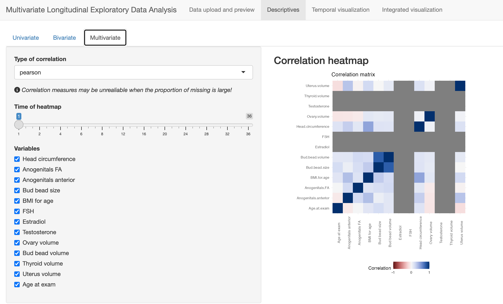

```{r setup, include=FALSE}
knitr::opts_chunk$set(echo = FALSE)

library(tidyverse)
```

# Introduction {#sec:intro}

## Motivation 

Measures of health are often routinely collected over time in both research and clinical settings. For exmaple, individuals are likely to go through the same set of procedures during annual physical exams, such as vitals and blood/urine tests. The health indicators collected during these procedures are closely monitored for preventive health and can also be important basis for personalized health. In laboratory environment, multiple biomarkers maybe followed over time to understand the evolution of biological pathways. In community settings, large-scale surveys and censuses are conducted regularly to collect environmental, lifestyle, and socioeconomic information as basis of community health improvement. All of the above examples involve the collection of multiple measures temporally, namely the \textit{multivariate temporal data}. Because of the scale and complexity of such information, exploratory analysis is necessary. Investigators need effective and comprehensive representation of the data structure, so that potential problem can be identified, which further facilitates hypothesis generation and resource allocation for further research work. 

For a multivariate dataset collected over time, the correlation between the collected measures, especially how the correlation changes temporally, often reveal vital information. For example, changes in correlation between Earth system variables can provide valuable information for the assessment of the climate engineering deployment scenarios[@Mengis2019climate]. An effective exploration of the evolving structure of variables is an essential step of Exploratory Data Analysis (EDA) that will have fundamental impact on the following analysis, including hypothesis generating, model selection and scientific discoveries. Unfortunately, exploratory analysis methods and tools for multivariate temporal datasets are not well-developed, especially on the analysis of correlation. While exploration of data largely depend on graphic visualization, making such graphs demands high technical skills (e.g. programming, usage of specific software). As a result, domain experts without easy access to these techniques, are often discouraged from these tools that could significantly improve analysis efficiency. In interdisciplinary collaborations and/or public communication, these technicalities often cause communication barriers. The lack of intuitive, interpretable representation of information causes difficult in comprehension, and as a consequence discourages collaborators and audience from raising questions and feedback. Moreover, existing exploratory analysis are perceived as isolated summary tables and graphs, instead of a complete workflow. Different visualization schemes or summary statistics that can reflect different aspects of the same dataset are presented separately for the sole purpose of supporting more advanced analysis, and are rarely cross-reference. There also lacks a standardize EDA workflow, leaving the choice of methods largely up to discretion. The partiality and inconsistency does not help investigator to view the evidence integrally or objectively. 

The challenge above has inspired the development of TempNet-an accessible toolkit with a interactive, standardized workflow for exploratory analysis of multivariate temporal data. It comprehensively presents various aspects of data structure, visualizes the time-dependent intercorrelation, and is easy to operate even for users without statistical or coding background.


## Previous work


The structure of multivariate temporal datasets prohibits both mutli-dimensionality and temporal evolution. However, existing EDA methods are largely based on single variable or pairwise examination. Summary statistics (e.g., mean, standard deviation) and plots (e.g. boxplots, histograms) can summarize the distribution of variables one by one and time point by time point. The association between variables is often presented by pairwise matrix-based representation, such as correlation matrix, scatterplot matrix or heatmaps. These methods work well on small- or medium-dimensional datasets. However, the increasing dimensionality rapidly expands the information to summarize. The naive method above quickly become infeasible, because the density of information becomes too overwhelming for human eyes. In addition, these tools are also static and cannot reflect temporal changes. With the extra complexity of temporal evolution, they have to be reproduced at every time point. Investigators are required to flip back and forth across slices for examination and comparison. Such operation is not a good fit for information processing in human brain, as its time-consuming and repetitive, which increase the likelihood or error or negligence. 

Current literature has proposed methods for the visualization of high-dimensional or large-scale data. Since the challenge essential stems from scale, it is natural to use dimension reduction techniques. When the goal of analysis is to explore variable relationships, the subject of analysis becomes the correlation matrix instead of the data itself. Intuitively, one can also think of the correlation matrix as a dataset where each variable (row) is a subject, and its features are its correlation with other variables (columns). In this case, the correlation matrix essential becomes a time-dependent dataset with sample size equal to number of features. This naturally leads to the consideration of dimension reduction methods. However, one should be alert that this data violates the assumptions of many dimension reduction techniques designed for regular data matrices, render these methods inapplicable. For example, the rows (variables) are unlikely to be independently distributed like subjects. Moreover, the samples used to calculate correlation are not necessary the same across time, which is a very common case for regular large-scale population-level surveys like the NHANES data[@NHANES]. These studies consistently collect the same measure, but participants who took the survey change every time. With correlated variables and inconsistent sample, the correlation matrices, though time-dependent and even with the same set of variables, cannot be classified as "longitudinal" dataset. This makes many EDA methods based on longitudinal model inapplicable, such as Group-Based Model Trajectory (GBMT) and Latent Class Mixed Effect Model[@Lu2024LongCluster]. To decompose such a dataset, we need a dimension reduction method that imposes little assumptions on the data. One such example is Multidimensional Scaling (MDS) (also known as Principal Coordinates Analysis[@gower1966pcoa]. It represents a high-dimensional datasets on a lower-dimensional space, similar to Principal Component Analysis (PCA), but with less rigorous restrictions. MDS does not require linearity nor approximate Gaussian distribution. It is also designed to preserve the high-dimensional structure as much as possible, which PCA is not necessarily able to achieve. Considering the purpose of EDA is to examine the correlation matrix, it is ideal to preserve its structure, making MDS a better reduction for this specific case. 

The R package \textit{corrr} uses this method visualize a correlation matrices[@corrr]. The MDS process is embedded into the \textit{network\_plot} function. The correlation matrix is represented on a 2D space in a network plot format, where each variable is represented by a node and their coordinates is the output of MDS algorithms. The original value of correlation is also plotted as the edge between nodes, where the magnitude and sign of correlation coefficient are reflected in the thickness, transparency and color of edges. This function offers a clean, comprehensive visualization where variable correlation can be intuitively perceived by their relative positioning-the stronger the correlation is, the closer the variables are positioned to each other. However, it is a static plot and thus is subject to the same repetition procedure mentioned above when visualizing temporal evolution. 

Other R packages, although not explicitly for correlation, have been developed to combine MDS reduction with network visualization, such as \textit{igraph}[@igraph]. One can also implement the two steps separately-generate coordinates with MDS first and then plot variables in a network. R built-in function \textit{cmdscale}[@Rbuildin], packages \textit{MASS}[@MASS] and \textit{smacof}[@smacof] are good tools for implementing MDS and its many variations. Then we could make network plots with packages like \textit{igraph}[@igraph] and \textit{ggplot}[@ggplot2]. However, these packages also have limitations in representing temporal evolution-they can only represent one time point at a time. Integration over time requires additional tool to combine slices into graphic interchange format or animation. There have been a few packages developed for interactive or dynamic visualization, such as \textit{ndtv}[@ndtv] and \textit{networkDynamic}[@networkDynamic]. These packages do not require repetition of the entire process, but the data has to be formatted carefully such that time-varying features are explicitly specified for each time point. All the packages mentioned require high technical ability, such as fluency in R programming and understanding of data structure. They are not friendly to users without much technical background or coding experience, such as domain scientists or public user. 

Another shortcoming of existing EDA tools is their lack of coherence and interactivity. Each analysis methods are often implemented in isolation, producing single figure or summary statistics reflecting only a small component of the entire dataset. In practice, we often desire an integrated view of the entire dataset, especially with multiple variables across multiple time. Cross-reference across different components of data is frequently needed but not sufficiently supported by the existing exploratory analysis scheme. A more fluid, interactive workflow could release these operation burdens and thus improve efficiency of analysis. It can also overcome interdisciplinary communication barrier when accompanied with intuitive representation. Existing literature has demonstrated the preference toward interactive tools [@Lakkaraju2022]. Unfortunately, development in this areas has been sparse, with existing work largely restricted to non-exploratory modeling or univariate and bivariate summary [@EpiStatKit], or generative AI applications based on black-box deep learning.


# Motivational dataset {#sec:data}

This section introduces the motivational dataset that will be used through out this manuscript for demonstration purposes, in both Section \ref{sec:app} to explain the mlEDA workflow and functionalities, and Section \ref{sec:case_study} for a data application example to illustrate its practical utlity. This data was collected by the Infant Feeding and Early Development (IFED) study [@Adgent2018IFED], an NIH-funded longitudinal observational study of postnatal development of reproductive system on healthy term infants born in Philadelphia. From August 2010 to November 2013, eligible infants completed the baseline visit within 72 hours after birth. Subsequent visits were every 2-4 weeks. Boys were followed until 28 weeks and girls 36 weeks after birth. At each visit, anthropometry was performed on present participants for a set of group measures, such as length, weight, head circumference, etc. Blood sample collection began at week 2 and was analyzed for hormones (e.g. estrodiol, FSH). In some later weeks, ultrasound was performed immediately before or after regular visits to measure the dimension of organs, such as breast bud bead, thyroid, uterus and ovary. 

The original study intended to explore the effect of feeding regime [@Adgent2018IFED]. Since then, the data set has been explored for a variety of questions regarding early development of the reproductive system[@goldberg2024, more refs from goldberg]. Special interest has been shown in the postnatal activation of Hypothalamic-pituitary-gonadal (HPG) axis activation, often referred to as "minipuburty" in existing literature. During this time, hormones concentration could increase rapidly and stimulates development of target tissues, which can affect growth, body composition and behavioral development. Therefore, minipuburty is considered a critical window for early detection and treatment of disorders of sexual development [@Lucaccioni2021, @Renault2020]. Despite the importance, the biological pathways behind these phenomenon remain unclear. This is largely due to the complexity of multidimensional, dynamic interactions between factors, as well as the large variability in timing and duration of development across individuals. Existing research often uses univariate or pairwise examination, which provides facets of information instead of the full picture \ref{@Chin2023}. The study design of IFED data also poses specific challenges. The schedule of procedures are different between blood sample collection and ultrasound, causing discontinuity in the study of their correlation. Blood samples are consistently collected at each visits starting the second visit, but the hormone concentration is often too low to be detected, causing missing values in large proportion of the sample. This affects the reliability of correlation measure.

In the following sections we will explore.... we will only be using girls because of previous papers... 

```{r ifed, fig.cap="Illustration of IFED study design", out.width="80%"}
knitr::include_graphics("../Manuscripts/CaseStudy/IFED_miss.png")
```


# The TempNet App {#sec:app}

<!-- % potential names: Tnet, TemporalNet, TempoNet -->
To address the challenges in Section \ref{sec:intro}, we have created TempNet, a web-based application designed for interactive, standardized exploratory analysis workflow of multivariate temporal dataset. This application is an integration of classical EDA components and novel multidimensional visualization scheme. It also has the ability to visualize temporal evolution dynamically and intuitively to human vision. Moreover, it guides users through an comprehensive analytical workflow with interactive operations. Its usage requires minimal technical background or coding experience, thus desirable for the interdisciplinary collaboration settings. This section will demonstrate the functionalities of TempNet in details, using the the Infant Feeding and Early Development (IFED) study [@Adgent2018IFED] as a motivational example. The same dataset will also serve as a case study example in Section \ref{#sec:case}. 


## Functionalities {#sec:func}

The mlEDA Shiny App guides user through a series of operations to explore a full dataset. The entire work flow is briefly summarized in Figure \ref{fig:workflow}. Each step corresponds to a tab in the shiny app with funcionalities focusing on certain aspects of the dataset, such as descriptive graphs for univariate distribution and bivariate correlation, multivariate structure and time evolution. All tabs in mlEDA consists of a input panel on the left and an output panel on the right. The former for user inputs, and the later for analytical output following user operation. 

<!-- {#fig:workflow width=80%} -->

### Data upload and preview
    
The first tab of mlEDA allows user to upload a dataset from their own local device. Currently, the dataset is required to be a csv file with long-format, meaning each row is an observation from one subject at a single time point, and repeated measures at different times should be vertically stacked. The uploaded dataset will then be displayed on the output panel, together with a brief summary of sample size and follow-up times. 

It is also important that user should specify the time and subject identifier in this tab, as those are the defining factors of repeated measures over time and will affect future analysis. In some cases a dataset can contain multiple variables for time or subject ID. The IFED dataset, as an example, recorded time both by the week a procedure is scheduled, or the number of days after birth. These variables are often highly correlated as they contains the same piece of information in different forms. Therefore, we recommend user to keep only one of them in the following analysis to avoid redundancy, unless they must be included for specific purposes. 

```{r fig-tab1, fig.cap="Temporal correlation structure", out.width="80%"}
knitr::include_graphics("../Manuscripts/AppShots/tab1.png")
```

### Descriptives

The second tab of mlEDA provides graphs and statistics for detailed exploration of subsets of the data. If offers three aspects of examination: univariate distribution, pairwise relationship and overall structure, implemented in three subtabs respectively.

#### Univaraiate

On the first "univariate" subtab, users can choose any single variable from the dataset and examine their distribution at each time point, as will as the change in distribution over time. However, please note that the appropriate methods to visualize these features largely depend on how the "time" variable is distributed. If time grid is relatively sparse (e.g. a handful of time points), users are more likely to think of time as discrete points and focus on each point specifically. On the other hand, a dense grid (e.g. a few hundreds of time points) is more likely to be interpreted as a continuous variable, where the trajectories over time become more important than distribution at each time point. The choice of perceiving time as categorical or continuous depends on the data structure as well as analysis context, and thus is often up to user discretion. Taking the IFED data as example, "week" will be treated as discrete since there are only 12 unique points over the entire dataset. However, infant age coded as days after birth ranges from 0 to 278, with 191 unique values present in between. It should be considered continuous due to this high-density.  

The mlEDA app accomodates this preference by giving user the option to specify time as discrete or continuous, and adjusts the visualization method accordingly. A variable over discrete time will be visualized as a series of boxplots, one at each measurement point (as Figure \ref{fig:tab2.1.1}) Temporal trend is represented by the change in sample median, while the discrepancy across sample is still highlighted at each time point (as Figure \ref{fig:tab2.1.2}).  If the user with the perceive time time as continuous, the app generates a spaghetti plot of individual trajectories, accompanied by as summary trajectory that is smoothed over time. Additional, it provides time-dependent summary of missing pattern across both sample and time. This is often of interest because high-proportion of missing values can severely affect the reliability of correlation measure. User could chose to display a summary table of proportion of missing at each time point, where high-missing will be highlighted. User may wish to remove high-missing variables or time points from down stream analysis to improve robustness.

```{r fig-tab2-sub1, fig.cap="Descriptives of individual variable distribution and change over time. Figure (a) uses week of scheduled procedure as time. Figure (b) uses infant age as time, coded as days after birth.", fig.subcap=c("Discrete time", "Continuous time"), out.width = "0.45\\linewidth"}
knitr::include_graphics(c("../Manuscripts/Appshots/tab2.1.1.png", "../Manuscripts/Appshots/tab2.1.2.png"))
```


#### Paiwise
The second subtab examines the time-varying correlation between any pair of variables. User can choose any two variable from the dataset and their preferred correlation measure (pearson or spearman). A plot of correlation trend is then generated on the output panel showing the empirical correlation value at each measurement point. However, please note that the scale of missing is also visualized on the same plot. The points are not only representing the value of correlation coefficient. Their size also indicate how many pairs of observations are used for calculating this correlation. This information is very important because it is relevant to the reliability of correlation. Large point size indicates a large sample, and thus more reliable correlation, and vice versa. In some cases, a pair of variables may have only 2 complete pairs at a single time point, and the correlation measure will always be 1 or -1, which clearly is meaningless. This in fact happened in the IFED dataset, especially when age is considered as time. The 136 participants are spread over 278 days, making sample size at each time point very small. Therefore empirical correlation frequently hits extreme values. 


```{r fig-tab2-sub2, fig.cap="Descriptives of pairwise correlation and its change over time. Figure (a) uses week of scheduled procedure as discrete time. Figure (b) uses infant age as continuous time, coded as days after birth.", fig.subcap=c("Discrete time", "Continuous time"), out.width = "0.45\\linewidth"}
knitr::include_graphics(c("../Manuscripts/Appshots/tab2.2.1.png", "../Manuscripts/Appshots/tab2.2.2.png"))
```

Distribution and/or trajectories of the two variables are displayed together for comparison. The visualization scheme is similar to the previous tab, and thus not displayed in the manuscript for the conciseness. User can also chose to fix the vertical axis range correlation plot between -1 and 1 if they prefer by unchecking the "scale correlation axis to data" box. If user selects less than or more than two variables by mistake, the app will display a warning message. 

#### Overall 

Tab 3 display the empirical correlation matrix in a heatmap, using different colors for direction and hue for magnitude. User can scroll over the time axis on the input panel to examine its change over time. The structure is simple and straightforward, thus are not displayed in the manuscript for simplicity. 

```{r fig-tab2-sub3, fig.cap="Descriptives of the correlation structure of the entire dataset", out.width="80%"}

```

### Temporal visualization
    
This tab hosts the core functionality of the mlEDA app - a dynamic network graph of multivariate correlation and/or association (DCAN). We proposed this novel visualization scheme to offer a comprehensive, concise and interpretable representation of the complicated and evolving relationship between multiple measures. The layout reflects the matrix of correlation or association measures on one 2D surface, with nodes indicates variables, and their relative position indicating the strength of relationship. Strongly associated variables are positioned closer to each other while weakly associated variables are positioned further away from each other. By scroll over the time axis on the input panel, user will see the DCAN graph layout adjusts in a visually stable way, using minimal movement to adapt to the data structure at the current time point. As Figure [@fig-tab3] shows, the plot is generated by different two different methods, based on user with to perceive time. The following Section \ref{sec:mds} will explain in detail the how the layout is generated and visual stability is preserved. Here we focus on the visualization scheme. For example, in Figure \ref{fig-tab3}, the two anogenital measures are very close to each other, indicating very strong correlation between them. This is intuitive considering they measure the same subject from different aspects. On the other hand, uterus volume and head circumference are very far in position, indicating weak correlation. As is shown, the plot maps the strength of correlation onto the distance between nodes on a 2D surface, thus lead to an intuitive visualization that can be efficiently interpreted. 


```{r fig-tab3, fig.cap="Dynamic Correlation and Association Network plot.", fig.align='center', out.width = "0.6\\linewidth"}
knitr::include_graphics(c("../Manuscripts/Appshots/tab3.png"))
```

More interactive features are incorporated in this tab to accommodate users' needs and preferences. Users can choose to display correlation over certain thresholds. These large correlations are visualized as an edge connecting the corresponding two variables, and the thickness and color hue of the edges reflects the magnitude of the correlation. In Figure \ref{fig:fig-tab3}, correlation threshold is set to 0.51, and edges appeared between FSH and ovary volume, and bud bead size and bud bead volume, meaning they are the only variable pairs whose correlation is greater than 0.5. In practice, user may with to identity groups of variables with stronger intercorrelation (i.e., "clusters" of variables). TempNet has a corresponding complementary function on this tab to group variables by performing a time-dependent hierarchical clustering on the correlation/association measures. The clustering is implmented on the lower-dimensional coordinates instead of the empirical higher dimensional structure, since the lower dimensional structure is more stable over time (see section \ref{sec:mds} for details). User can choose the number of groups, and the variable vertices will be colored differently by group assignment. A few summary of group labels over time can be displayed below the network graph, where user can examine the change of grouping results over time from different perspectives. If a group of interest in identified, user can also regenerated the plot only for these subset of variables for more detailed analysis. 

<!-- why is clustering done on 2D space? -->
<!-- what are the group-summary plot respectively? -->
<!-- Empty circles in spl MDS -->

### Integrated visualization

The fourth tab offers an time-independent overall summary of the entire follow up period. It averages the correlation or associatia matrix from all time points during the follow up time, and then visualize this "average" matrix using the same mechanism as DCAN in tab 3. User can either treat all time points equally, or weigh them by the time interval in between. The "weighted" option takes a "last observation carried over" approach, assuming correlation structure does not change until the next time point. It therefore weighs each time point by the interval following. This time-independent summary could be good complementary information to user inspection. As Figure \ref{fig:fig-tab4} shows, the structure of this tab is very similar to tab 3, except for the time-varying components. They also share similar interactive functionalities, such as specifying measure threshold, grouping, and chooing subsets of data. 

```{r fig-tab4, fig.cap="Integrated netowrk visualization of correlation or association matrix", fig.align='center', out.width = "0.6\\linewidth"}
knitr::include_graphics(c("../Manuscripts/Appshots/tab4.png"))
```

# Dynamic Correlation and Association Netowrk {#sec:mds}

In this section, we explain in more details about the core functionality of mlEDA: the Dynamic Correlation and Association Network (DCAN). We explain how the plot is generated to reflect the correlation structure of the dataset, while also maintain a visual conciseness and stability. 

## Multidimensional Scaling

As in Section \ref{sec:intro}, exploratory analysis methods for multivariate longitudinal datasets are not well-developed. Existing literature of EDA largely focus on studying the relationship between subjects but not variables. Dimension reduction or clustering, which are arguably the two most widely used EDA methods, both set up the data with raw as subjects and columns as variables [@esl2ed]. However, exploration of correlation is the study of relationship between \textit{variables}, or in other words, the matrix of correlation, association or distance measures. This distinction makes a lot of existing methods inapplicable, because such matrices do not satisfy may common assumptions these methods make, such as i.i.d observations. However, multidimensional scaling (MDS) is appropriate in this case, because it is highly flexible with few assumptions on the dataset. 

Essentially, MDS generates variable layout by estimating a set of low-diensional coordinates that mimics the high-dimensional matrix (i.e. correlation) as much as possible. Specifically, for a dataset $\mathbf{X}$ with P variables $X_1$, ..., $X_P$ at a specific time point, the relationship between variables will be represented by a P-dimensional matrix: $\Sigma(\mathbf{X}) = \{\rho_{lp}\}$, where $\rho_{lp}$ is the relationship between $\mathbf{X_l}$ and $\mathbf{X_p}$. There are many options for this relationship measure. The mlEDA app temporarily supports three: Pearson correlation, Spearman correlation and euclidean distance. MDS will transform this higher-dimensional into a "dissimilarity" matrix: $\symbf{\Delta} = \{\delta_{lp}\}$, with the method of transformation dependent on the chosen measure. For correlation, $\delta_{lp} = 1-|\rho_{lp}|$. Euclidean distance on the other hand can be a dissimilarity measure itself and needs no more transformation. 

The next step is to project the higher-dimensional dissimilarity  $\symbf{\Delta}$ onto a 2D surface. A variable $X_p$ is represented by two coordinates $(c_{p1}, c_{p2})$ indicating horizontal and vertical positions respectively. The distance between any pair of variables, given their coordinates, can be easily calculated: $d_{lp} = \sqrt{(c_{l1}-c_{p1})^2+(c_{l2}-c_{p2})^2}$. The matrix of pairwise Euclidean distance is a P by P matrix: $\mathbf{D}= \{d_{lp}\}$. Since we would like the geometrical distance to reflect higher-dimensional measures, this problems comes down to minimizing the difference between $\symbf{\Delta}$ and $\mathbf{D}$. This leads to the stress loss function\cite{kruskal1964}: 

\begin{equation}
    Stress(\mathbf{C}) = \frac{||\symbf{\Delta} - \mathbf{D}||^2}{||\symbf{\Delta}||^2}.
    \label{eq:stress}
\end{equation}

By minimizing the stress loss \ref{eq:stress}, we will be able to get the 2D coordinates that is most reflective of the correlation structure. 

## Temporal stability

Note that the MDS algorithm alone does not consider time changes. The classic algorithm proposed by [@gower1966pcoa], as well as many its extensions, are able to visualize one matrix at a time. For a series of matrices at different time point, there needs to be one separate MDS procedure done at each time point. We can consider the evolution process of data structure as a "movie", then each representation generated by MDS at a specific time point would be a "screenshot". However, it is not ideal to simply regenerate a separate plot at each time point. Regeneration will induce random initialization of vertices positions. When implemented repeatedly over time, this causes variable nodes to bounce around the surface, causing high visual instability and disorientation. This goes against the purpose of mlEDA, which is to introduce intuitive visualization that is easy for human comprehension. A temporally stable extension of classic MDS is needed to solve this issue. In this section, we will introduce two different approaches for this purpose: Dynamic MDS and Splines MDS. The major difference between these two methods is how they perceive the time variable. While Dynamic MDS treats time as discrete points, Splines MDS treats time as the observations of a continuous variable. 

### Dynamic MDS

One way to achieve visual stability over time is to minimize the change of layout between adjacent time points. This leads us to the Dynamic MDS methods by [@xu2012], which impose penalization on the coordinate change between all adjacent slices. The loss function in this case is penalized stress below: 

\begin{equation}
 Loss(\mathbf{C}) = \sum_{t}\frac{||\symbf{\Delta}_t - \mathbf{D}_t||^2}{||\symbf{\Delta}_t||^2}+
 \lambda ||\mathbf{C}_t-\mathbf{C}_{t-1}||^2.
    \label{eq:dMDSloss}
\end{equation}

This method is very straightforward and works well on datasets with low measurement density. As an example, when we use "week" as time in the IFED dataset, there are 12 unique time points, leading to 12 sets of coordinates to estimated. However, the computation time increases exponentially with measurement grid density and quickly becomes unfeasible. Our simulation shows a dataset with 100 unique repeated measures can take up to 2.5 hours to generate a compete graph.

In addition to computational burden, this method also works poorly with the presence of missing values, or when the measurement grids are different across variables. Unfortunately, both issues are very common in practice. In the IFED datasets, the three procedures are not scheduled in conjunction. Office visits and sample collection are scheduled twice as frequent as ultrasounds. From Equation 
\ref{eq:dMDSloss} we can see that only vertices that are present in both adjacent time points can be counted into the penalization. At time points when growth measures and hormones are present but ultrasounds are complete missing, the relationship between ultrasounds and other measures cannot be calculated, and these variables cannot be visualized. The corresponding vertices, as a consequence, will appear and disappear from the graph repeatedly, causing visual disorientation. During each procedure, there are also sometimes large proportion of missing values. For example, Estradiol has consistently high proportion of missing, with over 20% missing at all time points. When implemented on such datasets, Dynamic MDS often fail to generate stable visualization even with heavy penalization. This is because missing values cannot contribute to the penalization and thus cannot influence the generated layout.

### Splines MDS

While the relationship between variables changes with time, we can also assume this evolution to be a smooth process over time. It follows that its lower-dimensional representation will also be a smooth process, represented by the smooth change over time of vertex coordinates $\mathbf{C}_t = (c_{p1}(t), c_{p2}(t))$, where $p = 1....P$. A natural choise is to model the coordinates using spline basis functions:

\begin{equation}
\begin{aligned}
c_{p1}(t) &= \sum_{k=1}^K \xi_{pk}\phi_k(t) = \symbf{\xi}_p \mathbf{\Phi}(t) \\
c_{p2}(t) &= \sum_{k=1}^K \zeta_{pk} \phi_k(t) = \symbf{\zeta}_p \mathbf{\Phi}(t)
\end{aligned}
\end{equation}

The position of the vertex indicating variable $X_p$ will then change smoothly with t, determined by parameters $\symbf{\xi}_p$ and $\symbf{\zeta}_p$.It follows that the lower dimensional representation $\mathbf{D}$ will be a collection of the smooth coordinates: $\symbf{D}(t, \symbf{\xi}, \symbf{\zeta}) = \{\mathbf{c}_p(t), p = 1...P\}$. And the stress function can be written as $Stress(\mathbf{C}(t, \symbf{\xi}, \symbf{\zeta})) = \frac{||\symbf{\Delta}_t - \mathbf{D}(t)||^2}{||\symbf{\Delta}_t||^2}$.

Following these assumptions, the stability of layout can be controlled by penalizing the "smoothness" of coordinate functions, such as their second derivatives:

\begin{equation}
\begin{aligned}
    Loss(\symbf{\xi}, \symbf{\zeta}) = \int_t Stress(\symbf{C}(t, \symbf{\xi}, \symbf{\zeta})) + \sum_{p=1}^P\lambda(\symbf{\xi}_p+\symbf{\zeta}_p)\symbf{\Phi}''
    \label{eq:SPLloss}
\end{aligned}
\end{equation}

Splines MDS layout estimated by minimizing Equation \ref{eq:SPLloss} has a few advantages over the Dynamic MDS approach. First of all, the Spliens basis functions are shared across variables. Threrfore, the vertex coordinates computed here is determined by spline basis coefficients $\symbf{\xi}_p, \symbf{\zeta}_p$, which are time-independent. With irregular measurement grid, although some variables can be completely missing at some time points, their layout could still be computed in a consistent manner. The mlEDA app support this function and annotates the completely missing variables with unfilled circles instead of solid nodes. This keeps all variables in the plot and thus makes the plot more visually stable, revealing smooth, gradual structural evolution over time. 

In addition, with the measurement grid is dense, the loss function \ref{eq:SPLloss} is a lot more efficient to minimize, because it estimates a lot less parameters and also can be parallzied oever time. In the IFED dataset with age as time, the different of computation time between Dynamic and Splines MDS is a few hours versus a few minutes. When the density of data makes Dynamic MDS infeasible, Splines MDS will be the only choice for visualization. 

# Case Study {#sec:case_study}

In this case study, we apply the mlEDA app to our motivational dataset and demonstrate its use and efficiency in a practical setting. Recall Section \ref{sec:funt} has discussed the different ways of perceiving time-discrete versus continuous. The appropriate choice depends on the data structure and analytically context, and is often up to user discretion. In the mlEDA app, this choice is made on the first descriptives tab (Tab 2.1) and will affect downstream analysis, especially the method used to generate the Dynamic Correlation and Association graph. Therefore, we use two different time variables in IFED as time to demonstrate the two different workflows. Visit scheduled by weeks after birth will be the discrete time variables, with 12 unique values range from 1 to 36 with uneven distribution. The age of infants, recorded as days after birth, will be the continuous time variable, with 191 unique values also unevenly spaced from 0 to 278. In fact, visit week can be considered as binned age in days.

We use a subset of all the measures collected and removed other measures due to duplication or high-colinearity. The dataset of interest includes basic growth measures, such as age-adjusted BMI, head circumference and anogentital measures, hormones and volume measures of reproductive organs derived from ultrasound. The investigators are particularly interested in variables relationship regarding hormones and hoping to make inferences of the underlying biological process by examining the change of correlation between hormones and other meausres. Through out this section, Spearman correlation will be used for the relationship measure between variables. It is nonparametric with straightforward interpretation and also popularly used for practice. 

Figure \ref{fig:ifed_dcan} shows a few selected slices during the entire following up period, The animation of the full dynamic graphs over all time points can be found in the supplemetary materials. The first row are network graphs generated by Dynamic MDS with week as discrete time. Weeks 4, 16 and 32 are chosen because they have relatively complete data and also represents the start, middle and end of the study. The second row are Splines MDS graphs with age in days as time. The 27th, 111st and 224th days are the sample median age corresponding to week 4, 16 and 32, therefore chosen for display to offer a comparision between two methods.


```{r ifed_dcan, fig.cap="Selected correlation network graph of the IFED data."}
dcan_name <- c("DynWeek4.png", "DynWeek16.png", "DynWeek32.png",
               "SplDay27.png", "SplDay111.png", "SplDay224.png")
captions <- c("Dynamic, week 4", "Dynamic, week 16", "Dynamic, week 32",
              "Splines, day 27", "Splines, day 111", "Splines, day 224")

dcan_list <- list()
for(p in seq_along(dcan_name)){
  path_p <- paste0("../Manuscripts/CaseStudy/", dcan_name[p])
  img_p <- png::readPNG(path_p)
  dcan_list[[p]] <- ggplot() +
    annotation_raster(img_p, 0, 1, 0, 1) +
    theme_void()+
    labs(title = captions[p])+
    theme(title = element_text(size = 7))
}

gridExtra::grid.arrange(grobs = dcan_list, ncol = 3, nrow = 2)
```


## References


