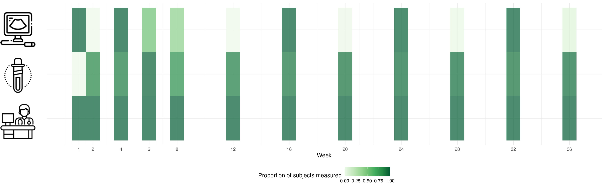
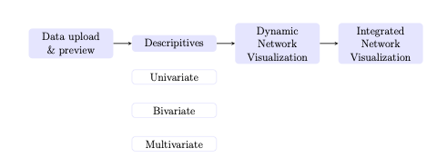
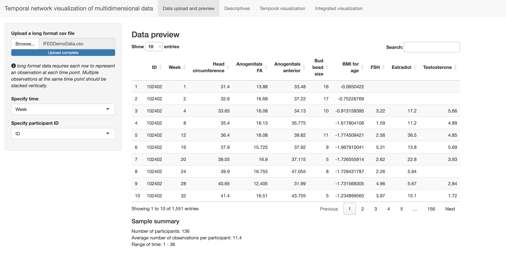
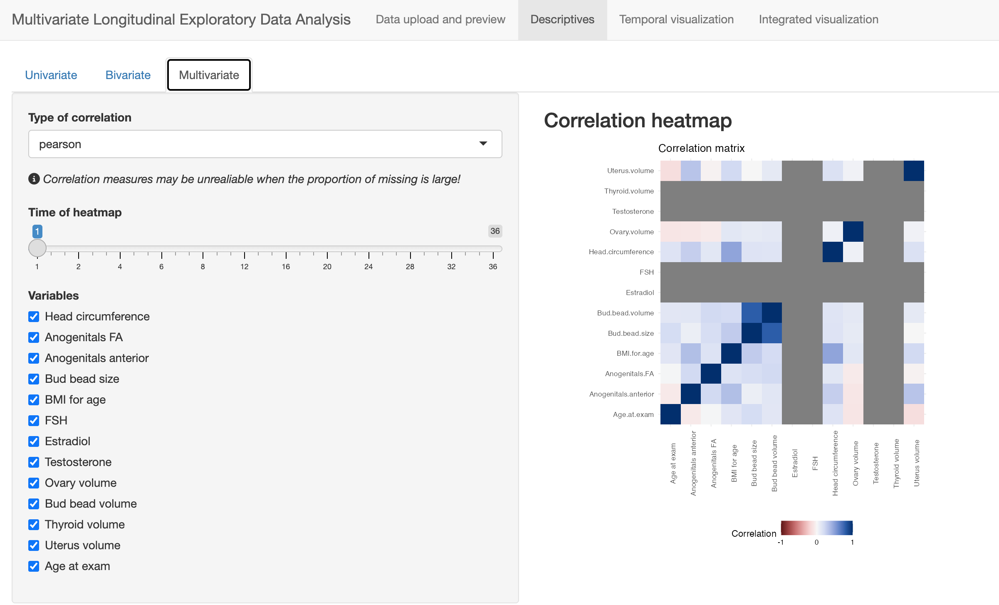

```{r setup, include=FALSE}
knitr::opts_chunk$set(echo = FALSE)

library(tidyverse)
library(here)
```

# Introduction {#sec:intro}

## Motivation 

Measures of health are often routinely collected over time in both research and clinical settings. For exmaple, individuals are likely to go through the same set of procedures during annual physical exams, such as vitals and blood/urine tests. The health indicators collected during these procedures are closely monitored for preventive health and can also be important basis for personalized health. In laboratory environment, multiple biomarkers maybe followed over time to understand the evolution of biological pathways. In community settings, large-scale surveys and censuses are conducted regularly to collect environmental, lifestyle, and socioeconomic information as basis of community health improvement. All of the above examples involve the repeated collection of multiple measures over a time, namely the \textit{multivariate longitudinal data}. 

Comprehensive exploratory analysis of such data is important because it can provide important insights into evolving biological processes and their interactions. It is the initial step of data analysis process, the basis of problem identification and hypothesis generation, and often determines the strategies and resource allocation of downstream analysis. The correlation between the collected measures, especially the temporal evolution of correlation. often reveal vital information. For example, changes in correlation between Earth system variables can provide valuable information for the assessment of the climate engineering deployment scenarios[@Mengis2019climate]. An comprehensive, effective exploration of the evolving data structure is fundamental. Unfortunately, such analyses are challenging due to complex and dynamic data structures. Exploratory data analysis (EDA) methods and tools for multivariate temporal datasets are not well-developed, especially on the analysis of correlation. The challenges above have inspired the development of mlEDA-an accessible toolkit with a interactive, standardized workflow for exploratory analysis of multivariate longitudinal data. It comprehensively presents various aspects of data structure, visualizes the time-dependent correlation, and is easy to operate even for users without statistical or coding background.


While exploration of data largely depend on graphic visualization, making such graphs demands high technical skills (e.g. programming, usage of specific software). As a result, domain experts without easy access to these techniques, are often discouraged from these tools that could significantly improve analysis efficiency. In interdisciplinary collaborations and/or public communication, these technicalities often cause communication barriers. The lack of intuitive, interpretable representation of information causes difficult in comprehension, and as a consequence discourages collaborators and audience from raising questions and feedback. Moreover, existing exploratory analysis are perceived as isolated summary tables and graphs, instead of a complete workflow. Different visualization schemes or summary statistics that can reflect different aspects of the same dataset are presented separately for the sole purpose of supporting more advanced analysis, and are rarely cross-reference. There also lacks a standardize EDA workflow, leaving the choice of methods largely up to discretion. The partiality and inconsistency does not help investigator to view the evidence integrally or objectively. 

## Previous work

The structure of multivariate longitudianl datasets prohibits both mutli-dimensionality and temporal evolution. However, existing EDA methods are largely based on single variable/univariate or pairwise/bivariate examination. Summary statistics (e.g., mean, standard deviation) and plots (e.g. boxplots, histograms) can summarize the distribution of variables one by one and time point by time point. The association between variables is often presented by bivariate representation in matrix form, such as correlation matrix, scatterplot matrix or heatmaps. These methods work well on small- or medium-dimensional datasets. However, the increasing dimensionality rapidly expands the information to summarize. The naive method above quickly become infeasible, because the density of information becomes too overwhelming for human eyes. In addition, these tools are also static and cannot reflect temporal changes. With the extra complexity of time, they have to be reproduced at every time point. Investigators are required to flip back and forth across slices for examination and comparison. Such operation is not a good fit for information processing in human brain, as its time-consuming and repetitive, which increase the likelihood or error or negligence. 

Current literature has proposed methods for the visualization of high-dimensional or large-scale data. Since the challenge essential stems from scale, it is natural to use dimension reduction techniques. When the goal of analysis is to explore variable relationships, the subject of analysis becomes the correlation matrix instead of the data itself. Intuitively, one can also think of the correlation matrix as a dataset where each variable (row) is a subject, and its features are its correlation with other variables (columns). In this case, the correlation matrix essentially becomes a time-dependent dataset with sample size equal to number of features. However, one should be alert that this data violates the assumptions of many dimension reduction techniques designed for regular data matrices, render these methods inapplicable. For example, the rows (variables) are unlikely to be independently distributed like subjects. Moreover, the samples used to calculate correlation are not necessary the same across time, which is a very common case for regular large-scale population-level surveys like the NHANES data[@NHANES]. These studies consistently collect the same measures, but participants who took the survey change every time. This makes many EDA methods based on longitudinal model inapplicable, such as Group-Based Model Trajectory (GBMT) and Latent Class Mixed Effect Model[@Lu2024LongCluster]. To decompose such a dataset, we need a dimension reduction method that imposes less assumptions on the data. One such example is Multidimensional Scaling (MDS) (also known as Principal Coordinates Analysis[@gower1966pcoa]). It represents a high-dimensional datasets on a lower-dimensional space, similar to Principal Component Analysis (PCA), but with less rigorous restrictions. MDS does not require linearity nor approximate Gaussian distribution. It is specifically designed to preserve the high-dimensional structure representing pairwise relationships (e.g. distance, correlation), which methods like PCA is not necessarily able to achieve.

The R package \textit{corrr} uses this method visualize a correlation matrices[@corrr]. The MDS process is embedded into the \textit{network\_plot} function. The correlation matrix is represented on a 2D space in a network plot format, where each variable is represented by a node and their coordinates is the output of MDS algorithms. The original value of correlation is also plotted as the edge between nodes, where the magnitude and sign of correlation coefficient are reflected in the thickness, transparency and color of edges. This function offers a clean, comprehensive visualization where variable correlation can be intuitively perceived by their relative positioning-the stronger the correlation is, the closer the variables are positioned to each other. However, it is a static plot and thus is subject to the same repetition procedure mentioned above when visualizing temporal evolution. Other R packages, although not explicitly for correlation, have been developed to combine MDS reduction with network visualization, such as \textit{igraph}[@igraph]. One can also implement the two steps separately-generate coordinates with MDS first and then plot variables in a network. R built-in function \textit{cmdscale}[@Rbuildin], packages \textit{MASS}[@MASS] and \textit{smacof}[@smacof] are good tools for implementing MDS and its many variations. Then we could make network plots with packages like \textit{igraph}[@igraph] and \textit{ggplot}[@ggplot2]. However, these packages also have limitations in representing temporal evolution-they can only represent one time point at a time. Integration over time requires additional tool to combine slices into graphic interchange format or animation. There have been a few packages developed for interactive or dynamic visualization, such as \textit{ndtv}[@ndtv] and \textit{networkDynamic}[@networkDynamic]. These packages do not require repetition of the entire process, but the data has to be formatted carefully such that time-varying features are explicitly specified for each time point. All the packages mentioned require high technical ability, such as fluency in R programming and understanding of data structure. They are not friendly to users without much technical background or coding experience, such as domain scientists or public user. As a result, domain experts without easy access to these techniques are often discouraged from these tools that could significantly improve analysis efficiency. In interdisciplinary collaborations and/or public communication, these technicalities often cause communication barriers. The lack of intuitive, interpretable representation of information causes difficult in comprehension, and as a consequence discourages collaborators and audience from raising questions and feedback. 

Another shortcoming of existing EDA tools is their lack of coherence and interactivity. Each analysis methods are often implemented in isolation, producing single figure or summary statistics reflecting only a small component of the entire dataset. In practice, we often desire an integrated view of the entire dataset, especially with complicated data structure. Cross-reference across different components of data is frequently needed but not sufficiently supported by the existing exploratory analysis scheme. A more fluid, interactive workflow could release these operation burdens and thus improve efficiency of analysis. It can also overcome interdisciplinary communication barrier when accompanied with intuitive representation. Existing literature has demonstrated the preference toward interactive tools [@Lakkaraju2022]. Unfortunately, development in this areas has been sparse, with existing work largely restricted to non-exploratory modeling or univariate and bivariate summary [@EpiStatKit], or generative AI applications based on black-box deep learning. There also lacks a standardize EDA workflow, leaving the choice of methods largely up to individual discretion. 


# Motivational dataset {#sec:data}

This section introduces the motivational dataset that will be used through out this manuscript for demonstration purposes, in both Section \ref{sec:app} to explain the mlEDA workflow and functionalities, and Section \ref{sec:case_study} for a data application example to illustrate its practical utility. This data was collected by the Infant Feeding and Early Development (IFED) study [@Adgent2018IFED], an NIH-funded longitudinal observational study of postnatal development of reproductive system on healthy term infants born in Philadelphia. From August 2010 to November 2013, eligible infants completed the baseline visit within 72 hours after birth. Subsequent visits were scheduled every 2-4 weeks. Boys were followed for 28 weeks and girls 36 weeks after birth. At each visit, anthropometry was performed on present participants for a set of group measures, such as length, weight, head circumference, etc. Blood sample collection began at week 2 and was analyzed for hormones (e.g. estradiol, FSH). In later weeks, ultrasound was performed immediately before or after regular visits to measure the dimension of organs, such as breast bud bead, thyroid, uterus and ovary. 

The original study intended to explore the effect of feeding regime [@Adgent2018IFED]. Since then, the data set has been explored for a variety of questions regarding early development of the reproductive system[@goldberg2024]. Special interest has been shown in the postnatal activation of Hypothalamic-pituitary-gonadal (HPG) axis activation, often referred to as "minipuburty" in existing literature. During this time, hormones concentration could increase rapidly and stimulates development of target tissues, which can affect growth, body composition and behavioral development. Therefore, minipuburty is considered a critical window for early detection and treatment of disorders of sexual development [@Lucaccioni2021, @Renault2020]. Despite the importance, the biological pathways behind these phenomenon remain unclear. This is largely due to the complexity of multidimensional, dynamic interactions between factors, as well as the large variability in timing and duration of development across individuals. Existing research often uses univariate or pairwise examination[@Chin2023], which provides facets of information instead of the full picture. The study design of IFED data also poses specific challenges. The schedule of procedures are different between blood sample collection and ultrasound, causing discontinuity in the study of their correlation. Blood samples are consistently collected at each visits starting the second visit, but the hormone concentration is often too low to be detected, causing missing values in large proportion of the sample and leading to unreliable correlation measures. 

In the following section we will use this dataset as an example to illustrate the workflow and functionalists that mlEDA offers. More detailed regarding the analysis and intepretation of results will be presented in Section \ref{sec:case_study}. Considering the different biological mechanism of child development between boys and girls, the two sexes are often analyzed separately. In this paper, we will focus on the data from infant girls, as "minipuberty" is less understood or explored in girls compared to boys. 

```{r ifed, fig.cap="Illustration of IFED study design", out.width="70%", fig.align='center'}

```


# The mlEDA App {#sec:app}

<!-- % potential names: Tnet, TemporalNet, TempoNet -->
To address the challenges in Section \ref{sec:intro}, we have created mlEDA, a web-based application designed for interactive, standardized exploratory data analysis workflow of multivariate longitudinal dataset. This application is an integration of classical EDA components and novel multidimensional visualization scheme with the ability to visualize temporal evolution dynamically and intuitively to human vision. It guides users through an comprehensive analytical workflow with interactive operations. Its usage requires minimal technical background or coding experience, thus desirable for the interdisciplinary collaboration settings. This section will demonstrate the functionalities of mlEDA in details, using the the Infant Feeding and Early Development (IFED) study introduced in \ref{sec:data} as a motivational example. The same data will also serve as a case study example in Section \ref{sec:case_study}. 


## Functionalities {#sec:func}

The mlEDA Shiny App guides user through a series of operations to explore various facets of a full dataset. The entire workflow is briefly summarized in Figure \ref{fig:workflow}. Each step corresponds to component of analysis wrapped in a single tab, such as data upload and preview, descriptive statistics and graphs, dynamic visualization and integrated, time-independent visualization. All tabs in mlEDA consists of a input panel on the left side and an output panel on the right side. Users can give commands and specify options in the input panel, and analysis results will be interactively generated and displayed on the output panel. 

```{r workflow, fig.cap="mlEDA workflow summary", out.width="70%", fig.align='center'}

```

### Data upload and preview
    
The first tab of mlEDA allows user to upload a dataset from their own local device. Currently, the dataset is required to be a csv file with long-format, meaning each row is an observation from one subject at a single time point, and repeated measures at different times should be vertically stacked. The uploaded data will then be displayed on the output panel in a table format, followed by a brief summary of sample size and follow-up times. 

It is also important that user should specify the time and subject identifier in this tab, as those are the defining factors of repeated measures over time and will affect future analysis. In some cases a dataset can contain multiple variables for time or subject ID. The IFED dataset, as an example, recorded time both by the week a procedure is scheduled, or the number of days after birth. These variables are often highly correlated as they contains the same piece of information in different forms. Therefore, we recommend user to keep only one of them in the following analysis to avoid redundancy, unless they must be included for specific purposes. 

```{r fig-tab1, fig.cap="Temporal correlation structure", out.width="80%"}

```

### Descriptives

The second tab of mlEDA provides graphs and statistics for detailed exploration of subsets of the data. If offers three aspects of examination respectively under three subtabs: univariate distribution, bivariate correlation and multivariate correlation. 

#### Univaraiate

On the first "Univariate" subtab, users can choose any single variable from the dataset and examine its distribution at each time point and the change in distribution over time. The choice of summary graphs depends on how the "time" variable is perceived. If time grid is relatively sparse and irregular(e.g. a handful of time points), users are more likely to think of time as discrete points and focus on the average summary at each time point. On the other hand, a dense, regular grid is more likely to be interpreted as a continuous variable, where the individual trajectories over time become more important than distribution at each time point. The choice of perceiving time as categorical or continuous depends on the data structure as well as analysis context, and thus is often up to user discretion. Taking the IFED data as example, time can be treated as discrete since there are only 12 unique scheduled visits over the follow up period. It can also be preceived as continuous, as the visits are timed by number of weeks after birth. In some studies, infant age coded as days after birth is used as the time variable, making a denser grid with 191 unique values present in between 0 and 278. This should be considered continuous due to this high-density.  

The mlEDA app accommodates the potential different in time by giving user the option to specify time as discrete or continuous and adjusts the visualization method and following analysis accordingly. A variable over discrete time will be visualized as a series of boxplots, highlighting sample distribution at each measurement point. Temporal trend is then represented by the change in time-specific sample median, while the discrepancy across sample is still highlighted at each time point(Figure \ref{fig:fig-tab2-sub1}a).  For continuous time, the app generates a spaghetti plot of individual trajectories, accompanied by as summary trajectory smoothed over time (Figure \ref{fig:fig-tab2-sub1}b). Additionally, it provides time-dependent summary of missing pattern across both sample and time. This is often of interest because high-proportion of missing values can severely affect the reliability of summar statistics. User could chose to display a summary table of proportion of missing at each time point, where high-missing will be highlighted. User may wish to remove high-missing variables or time points from down stream analysis to improve robustness.

```{r fig-tab2-sub1, fig.cap="Descriptives of individual variable distribution and change over time. Figure (a) uses week of scheduled procedure as time. Figure (b) uses infant age as time, coded as days after birth.", fig.subcap=c("Discrete time", "Continuous time"), out.width = "0.45\\linewidth"}
knitr::include_graphics(c("../Manuscripts/Appshots/tab2.1.1.png", "../Manuscripts/Appshots/tab2.1.2.png"))
```


#### Bivariate

The second subtab examines the time-dependent correlation between any pair of variables. User can choose any two variable from the data and their preferred correlation measure (pearson or spearman). A plot of correlation trend is then generated in the output panel showing the empirical correlation value at each measurement point. Please note here the scale of missing is also visualized on the same plot. The points not only represents the value of correlation coefficient. Their size also indicates how many observations are used for calculating the correlation at each time. This information is very important because it is relevant to the reliability of correlation. Large point size indicates a large sample, and thus more reliable correlation, and vice versa. Missing data is a practical and frequent issue in real-world data analysis. For example, for some variables in the IFED dataset, there may have only 2 complete pairs at a single time point, and the correlation measure will always be 1 or -1, which clearly is not informative. This can happen especially when the measurement grid is sparse. If age is considered as time in IFED data, the 136 participants would be spread over 278 days, making sample size at each time point very small. The empirical correlation therefore, frequently hits extreme values, as illustrated in Figure \ref{fig:fig-tab2-sub2}b. 


```{r fig-tab2-sub2, fig.cap="Descriptives of pairwise correlation and its change over time. Figure (a) uses week of scheduled procedure as discrete time. Figure (b) uses infant age as continuous time, coded as days after birth.", fig.subcap=c("Discrete time", "Continuous time"), out.width = "0.45\\linewidth"}
knitr::include_graphics(c("../Manuscripts/Appshots/tab2.2.1.png", "../Manuscripts/Appshots/tab2.2.2.png"))
```

The correlatio grpah allows users to adjust the vertical axis range correlation plot to data. A fixed axis range between -1, 1 give users a better idea of the magnitude of correlation, while a scaled one highlights relative change. In addition, distribution and/or trajectories of the two variables are displayed together below the correlation graph for comparison and reference. The visualization scheme is similar to the previous tab, except now two variables are displayed in one graph for comparison purpose. 

#### Multivariate 

Tab 3 display the empirical correlation matrix in a heatmap, using different colors for direction and hue for magnitude (Figure \ref{fig:fig-tab2-sub3}). User can scroll over the time axis on the input panel to examine its change over time. If a correlation cannot be computed, the corresponding square will be marked gray. 

```{r fig-tab2-sub3, fig.cap="Descriptives of the correlation structure of the entire dataset", out.width="80%"}

```

### Temporal visualization
    
This tab hosts the core functionality of the mlEDA app - a dynamic network graph of multivariate correlation and/or association. We proposed this novel visualization scheme to offer a comprehensive, concise and interpretable representation of the complicated and evolving relationship between multiple measures. The layout reflects the relationship between multiple variables on one 2D surface, with nodes indicates variables, and their relative position indicating the strength of relationship. Strongly associated variables are positioned closer to each other while weakly associated variables are positioned further away.  For example, in Figure \ref{fig:fig-tab3}, the two anogenital measures are very close to each other, indicating very strong correlation between them, which is consistent with intuition considering they measure the same subject from different aspects. 

By scrolling over the time axis on the input panel, user will see the graph layout adjust in a visually stable way, using minimal movement to adapt to the change of data structure over time. The following Section \ref{sec:mds} will explain in detail the how the layout is generated and visual stability is preserved. Here we focus on the visualization scheme. As is shown, the plot essentially maps the strength of correlation onto the distance between nodes on a 2D surface, thus lead to an intuitive visualization that can be efficiently interpreted. 

<!-- As Figure \ref{fig:fig-tab3} shows, the plot is generated by different two different methods, based on user with to perceive time.  -->

```{r fig-tab3, fig.cap="Dynamic network plot of variable association.", fig.align='center', out.width = "0.6\\linewidth"}
knitr::include_graphics(c("../Manuscripts/Appshots/tab3.png"))
```

More interactive features are incorporated in this tab to accommodate users' needs and preferences. Users can choose their preferred method to quantify variable relationship, such has correlation or distance. Users can also choose to highlight strong relationships by specifying a threshold on the input panel. Depending on the choice of measure, strong associations are visualized as an edge connecting the corresponding two variables, and the thickness and color hue of the edges reflects the magnitude of the relationship measure. In Figure \ref{fig:fig-tab3}, spearman correlation is visualized with its threshold is set to 0.5. It follows that edges appeared between FSH and ovary volume, and bud bead size and bud bead volume, meaning these two correlation coefficients are greater than 0.5. In practice, user may also wish to identity groups of variables with stronger association (i.e., "clusters" of variables). mlEDA has a corresponding complementary function on this tab to group variables by performing a time-dependent hierarchical clustering on the association measures. The clustering is implemented on the lower-dimensional coordinates instead of the empirical higher dimensional association matrix, since the lower dimensional structure is more stable over time (see section \ref{sec:mds} for details). Users can choose the number of groups, and the variable vertices will be colored differently by group assignment. A few summary of group labels over time can be displayed below the network graph, where user can examine the change of grouping results over time from different perspectives. If a group of interest in identified, user can also regenerated the plot only for these subset of variables for more detailed analysis. 

### Integrated visualization

The fourth tab offers an time-independent summary of variable association integrating the entire follow up period. It averages the association matrix from all time points during the follow up time, and then visualize this "average" matrix using the same network mechanism as tab 3. User can either treat all time points equally, or weigh them by the time interval in between. The "weighted" option takes a "last observation carried over" approach, assuming correlation structure does not change until the next time point. It therefore weighs each time point by the length of following interval. This time-independent summary could be good complementary information to user inspection. As Figure \ref{fig:fig-tab4} shows, the structure of this tab is very similar to tab 3, except for the time-dependent components. They also share similar interactive functionalists, such as specifying association threshold, grouping, and choosing subsets of data. 

```{r fig-tab4, fig.cap="Integrated netowrk visualization of correlation or association matrix", fig.align='center', out.width = "0.6\\linewidth"}
knitr::include_graphics(c("../Manuscripts/Appshots/tab4.png"))
```

# Dynamic netowrk plot of variable association {#sec:mds}

In this section, we explain in more details about the core functionality of mlEDA: the dynamic netowrk plot of variable association. We explain the method used for plot layout generation, how the high-dimensional assocaition structure is preserved and how visual stability across time is enhanced.

## Multidimensional Scaling

As in Section \ref{sec:intro}, exploratory data analysis (EDA) methods for multivariate longitudinal datasets are not yet well-developed. In the aspect of data reduction, existing literature largely focuses on studying the relationship between subjects but not variables. Principal component analysis (PCA) or clustering, which are arguably the two most widely used EDA methods for complicated data, both set up the data with rows as subjects and columns as variables [@esl2ed]. However, exploration of feature association is the study of relationship between \textit{variables}, or in other words, the matrix of bivariate quantitative association measure, such as correlation, association, or distance. This distinction makes many existing methods inapplicable, because association matrices do not satisfy may common assumptions these methods make, such as i.i.d observations. However, multidimensional scaling (MDS) is appropriate in this case, because it is highly flexible with few assumptions on the high-dimensional data structures. It assumes that the high-dimensional matrix is square and symmetric matrix with zero diagonal elements. The values in the matrix should corresponds to a "dissimilarity" between variables. Most association measures satisfy, or can be easily converted to meet these assumptions. 

Essentially, MDS generates variable layout by estimating a set of low-dimensional coordinates that resembles the high-dimensional association matrix as much as possible. Specifically, for a dataset $\mathbf{X}$ with P variables $X_1$, ..., $X_P$, at a specific time point, the relationship between variables will be represented by a P-dimensional matrix: $\Sigma(\mathbf{X}) = \{\rho_{lp}\}$, where $\rho_{lp}$ is the relationship between $\mathbf{X_l}$ and $\mathbf{X_p}$. MDS will first transform this higher-dimensional matrix into a "dissimilarity" matrix: $\symbf{\Delta} = \{\delta_{lp}\}$, with the method of transformation dependent on the chosen measure. In mlEDA, correlation is transformed as $\delta_{lp} = 1-|\rho_{lp}|$. Euclidean distance on the other hand can be a dissimilarity measure itself and needs no more transformation. 

The next step is to reduce the higher-dimensional dissimilarity  $\symbf{\Delta}$ onto a 2D surface. In the Cartesian coordinate system, a variable $X_p$ is represented by two coordinates $(c_{p1}, c_{p2})$ indicating horizontal and vertical positions respectively. The distance between any pair of variables, given their coordinates, can be easily calculated: $d_{lp} = \sqrt{(c_{l1}-c_{p1})^2+(c_{l2}-c_{p2})^2}$. The matrix of pairwise Euclidean distance is a P by P matrix: $\mathbf{D}= \{d_{lp}\}$. Since we would like the geometrical distance to reflect higher-dimensional measures, this problems comes down to minimizing the difference between $\symbf{\Delta}$ and $\mathbf{D}$. This leads to the stress loss function [@kruskal1964]: 

\begin{equation}
    Stress(\mathbf{C}) = \frac{||\symbf{\Delta} - \mathbf{D}||^2}{||\symbf{\Delta}||^2}.
    \label{eq:stress}
\end{equation}

By minimizing the stress loss \ref{eq:stress}, we will be able to get the 2D coordinates that is most reflective of the correlation structure. 

## Temporal stability

Note that the MDS algorithm alone does not consider time changes. The classic algorithm proposed by [@gower1966pcoa], as well as many its extensions, are able to visualize one matrix at a single time. For a series of matrices at different time point, there needs to be one separate MDS procedure at each time point. We can consider the evolution process of data structure as a "movie", then each representation generated by MDS at a specific time point would be a "frame". However, simple repeated implementation cause visual instability problems. Regeneration will induce random initialization of vertices positions. Although the higher-dimensional structure can be presered at each time point, variable nodes will rotate around the surface with no connection to the previous time points, causing high visual instability and disorientation. This goes against the purpose of mlEDA, which is to introduce intuitive visualization that is easy for human comprehension. A temporally stable extension of classic MDS is needed to solve this issue. In this section, we will introduce two different approaches for this purpose: Dynamic MDS and Splines MDS. The major difference between these two methods is how they perceive the time variable. While Dynamic MDS treats time as discrete points, Splines MDS treats time as the observations of a continuous variable. 

### Dynamic MDS

One way to achieve visual stability over time is to minimize the change of layout between adjacent time points. This leads us to the Dynamic MDS methods by [@xu2012], which impose penalization on the coordinate change between all adjacent slices. The loss function in this case is penalized stress below: 

\begin{equation}
 Loss(\mathbf{C}) = \sum_{t}\frac{||\symbf{\Delta}_t - \mathbf{D}_t||^2}{||\symbf{\Delta}_t||^2}+
 \lambda ||\mathbf{C}_t-\mathbf{C}_{t-1}||^2.
    \label{eq:dMDSloss}
\end{equation}

This method is very straightforward and works well on datasets that are regularly measured with low measurement density. However, the computation time increases exponentially with measurement grid density and quickly becomes unfeasible. In addition, this method also works poorly with the presence of irregular measurement grid, when variables in the data are measured at different time points. Unfortunately, both issues are very common in practice. As in Section \ref{sec:data}, in the IFED study, the three procedures are not scheduled in conjunction. Office visits and sample collection are scheduled twice as frequent as ultrasounds. From Equation \ref{eq:dMDSloss} we can see that only vertices that are present in both adjacent time points can be counted into the penalization. At time points when growth measures and hormones are present but ultrasounds are complete missing, the relationship between ultrasounds and other measures cannot be calculated, and these variables cannot be visualized. The corresponding vertices, as a consequence, will appear and disappear from the graph repeatedly, causing more visual disorientation.

<!-- use simulation to demonstrate time?  -->

### Splines MDS

While the relationship between variables changes with time, we can also assume this evolution to be a smooth process. It follows that its lower-dimensional representation will also be a smooth process, represented by smooth coordinates \text{functions} over time: $\mathbf{C}_t = (c_{p1}(t), c_{p2}(t))$, where $p = 1....P$. A natural choise is to model the coordinates using spline basis functions:

\begin{equation}
\begin{aligned}
c_{p1}(t) &= \sum_{k=1}^K \xi_{pk}\phi_k(t) = \symbf{\xi}_p \mathbf{\Phi}(t) \\
c_{p2}(t) &= \sum_{k=1}^K \zeta_{pk} \phi_k(t) = \symbf{\zeta}_p \mathbf{\Phi}(t)
\end{aligned}
\end{equation}

The position of the vertex indicating variable $X_p$ will then change smoothly with t, determined by parameters $\symbf{\xi}_p$ and $\symbf{\zeta}_p$. The lower dimensional representation $\mathbf{D}$ will be a collection of the smooth coordinates: $\symbf{D}(t, \symbf{\xi}, \symbf{\zeta}) = \{\mathbf{c}_p(t), p = 1...P\}$. And the stress function can be written as $Stress(\mathbf{C}(t, \symbf{\xi}, \symbf{\zeta})) = \frac{||\symbf{\Delta}_t - \mathbf{D}(t)||^2}{||\symbf{\Delta}_t||^2}$. As time changes, the stability of layout can be controlled by penalizing the "smoothness" of coordinate functions, such as their second derivatives:

\begin{equation}
\begin{aligned}
    Loss(\symbf{\xi}, \symbf{\zeta}) = \int_t Stress(\symbf{C}(t, \symbf{\xi}, \symbf{\zeta})) + \sum_{p=1}^P\lambda(\symbf{\xi}_p+\symbf{\zeta}_p)\symbf{\Phi}''
    \label{eq:SPLloss}
\end{aligned}
\end{equation}

Splines MDS layout estimated by minimizing Equation \ref{eq:SPLloss} has a few advantages over the Dynamic MDS approach. First of all, the Splines basis functions are shared across variables. Therefore, the vertex coordinates computed here is determined by spline basis coefficients $\symbf{\xi}_p, \symbf{\zeta}_p$, which are time-independent. With irregular measurement grid, although some variables can be completely missing at some time points, their layout could still be computed in a consistent manner. The mlEDA app supports this function and annotates the completely missing variables with unfilled circles instead of solid nodes. This keeps all variables in the plot and thus makes it more visually stable, revealing smooth, gradual structural evolution over time without the burdent of constantly adjusting to disppearing/reappearing nodes.

In addition, with the measurement grid is dense, the loss function \ref{eq:SPLloss} is a lot more efficient to minimize, because it estimates a lot less parameters and also can be paralleled over time. For example, the different of computation time between Dynamic and Splines MDS, when used on IFED data with age as time, is a few hours versus a few minutes, making Splines MDS the only feasible choice for visualization. 

# Case Study {#sec:case_study}

In this section, we demonstrate the practical utility of mlEDA using the discoveries it revealed on the IFED data. Because the essential difference in the reproductive system between sexes, boys and girls are usually analyzed separately. In this paper, we focus on the 136 full-term infant girls from the IFED study, exploring the interaction and evolution of physical growth, organ growth and hormone concentrations. Although existing literature on girls' early reproductive development is extensive, the discoveries showed controversies and complications. We hope this tools can offer novel insight using its concise, interpretable visualization and facilitate the generation of new hypothesis. Please note that though mlEDA provides different options for visualization, this paper will focus on evolution over week as a continuous time measure and spearman correlation as the association measure. 
<!-- reasons for this choice? -->


<!-- individual trend -->
Most physical growth measures, including head circumference and anogenital measures, showed steady growing trend over the entire follow-up period. Head circumference increased quickly during the first 3-4 months, and than gradually reaching a plateau at the end. Anogenital measures had a lot more fluctuation over time. Age-adjusted BMI stayed stable as expected. Hormone concentrations, on the other hand, showed high variability across individual and more fluctuation over time. Considering sample average, FSH, estradiol and testosterone all showed very slow and steady decrease over the 36 weeks. On the other hand, most individual tracks showed similarity, with at least one peak at different timing and with different magnitude. Most estradiol tracks started with a decrease in concentration at the first 5-10 weeks followed by small fluctuations. Some subjects had brief increase at week 12, 20 or 28. Testosterone showed a similar trend, with high initial concentration right after birth, a rapid decrease from 4-12 weeks and then fluctuations. The initial decreasing is likely due to subsiding placental hormones. Organ volume measured from ultrasound also showed notable heterogeneity. The average bud bead volume showed an initial increase from week 1-4, then flatten out across the following weeks. However, the individual tracks showed sharp increases of partial sample at week 4, 12 and 24. Similarly, the average ovary volume slowly increased from week 1-4 and plateaued, while individual tracks showed waves of peaks at week 4, 8, 12 and 24. Uterus volume had a more uniform trend, as most infants showed a sharp decline in volume from week 2 to 4. While most infants stayed steady after, there are infants whose uterus volume showed a later peak, but also across different timings including week 8, 12 and 24. Overall, the individual development track of reproductive organs and hormones revealed the existence of rapid development periods, but the timing and magnitude can be very different across individual. An average trend over sample might not be a good summary measure in this case. A more appropriate target of analysis would be the pattern of change over time. 

<!-- Pairwise correlation -->

The correlation between most growth measures are stable over time. Head circumference and BMI showed stable moderate correlation (0.5), and the two anogential measures (FA and anterior) showed slowly increasing correlation from roughly 0.2 to 0.5 over the first few weeks. The correlation between hormone concentrations are weaker, fluctuating across zero throughout follow-up. The correlation between estradiol showed a brief increase from 0.25 to 0.5 during week 4-8, but the soon decreased back to zero at week 16. In terms of reproduce organ volumes, some showed slight increase of correlation over the first few weeks. The correlation between ovary and uterus increased from 0.1 to 0.25 during the first few weeks. Similar for bud bead and uterus, their correlation increased to 0.3 during the first 8 weeks. Both correlation then decreased slowly until about week 24. Ovary and bud bead volume, on the other hand, did not show the initial correlation increase. Their correlation stayed at around 0.25 until week 16, followed by a slight decrease. The pairwise correlation between growth measures and hormones are generally close to zero with small fluctuations. The correlation between hormone concentrations and reproductive organ volumes are more uncertain, which is partly due to the inconsistency in procedure schedule and missing observations. Their correlation is generally week, with the exception of FSH and ovary value, which showed moderate negative correlation (-0.5-0.6) consistently throughout the study period. FSH and uterus has been weakly correlated (~-0.25) until week 24 when correlation reduced to zero. Estradiol and uterus showed a quick increase from 0 to 0.5 during the first 8 weeks, followed by decrease in the next 8 weeks.  

<!-- # notes: try to avoid observations after week 24 because of a lot of missing -->

<!-- Network graph -->

The dynamic network graph on tab 3 offers a comprehensive view of the evolution of the multidimensional correlation structure over time. This graph reflects the strength and change of relative correlation by the change in node positions. We start from week 4, which is the first time point when all measures are collected. As Figure \ref{fig:ifed-dcan}a shows, measures of growth, hormones and organs are roughly evenly distributed across the surface, indicating correlation across board is roughly equal and weak, which may corresponding to a "balanced" state right after birth before the rapid development began. Two growth measures, head circumference and age-adjusted BMI, are positioned close to each other at the top-left conner, indicating strong correlation at this time point. Similar with Ovary volume and FSH on the top-right corner. Both positions are consistent with their time-specific bivariate correlation (~0.5). The two anogenital measures are placed more apart, corresponding to the initial weak correlation (0.2-0.25) from weeks 1-4. Testosterone are slightly further from FSH and ovary volume, indicating weaker correlation. In fact, moving on from week 4, we can observe testosterone moving further away from FSH and ovary volume (\ref{fig:ifed-dcan} b). The two anogenital measures moved much closer from week 4 to 8, consistent with the increasing bivariate correlation from 0.2 to 0.5 during this period. They also clustered with other growth measures (head circumference and age-adjusted BMI). On the other side of the plot, FSH, estradiol, uterus volume, ovary volume and bud bead volumes also showed clustering effect. The physical growth measures were separating from the hormone concentrations and reproductive organ volumes. Testosterone and thyroid volume lays in between, showing association with neither group.


Approaching week 16, the cluster structure separating growth meausres from hormones and organ volumes stayed stable, but some previously close variables slowly disperse apart. Comparing \ref{fig:ifed-dcan}b and d, it is clear FSH and ovary volume moved further away. The growth measures showed more clustering to the center of the plot and closer to thyroid volume at week 16. Week 12 in the Figure below reflects an "in-between" status between week 8 and 16. Note that ultrasound was not scheduled at this week, therefore there are no organ volume measures in the data at this point. However, Splines MDS was able to impute their positioning given the layouts at other time points. This provides more visual stability compared to traditional dynamic MDS, in which the missing measures will simply disappear.

```{r ifed-dcan, fig.cap="Selected dynamic network graph of spearman correlation the IFED data.", fig.width=5, fig.align='center'}
dcan_name <- c("week4.png", "week8.png","week12.png","week16.png")
captions <- c("(a) Week 4", "(b) Week 8", "(c) Week 12", "(d) Week 16")

dcan_list <- list()
for(p in seq_along(dcan_name)){
  path_p <- paste0("Manuscripts/CaseStudy/", dcan_name[p])
  img_p <- png::readPNG(here(path_p))
  dcan_list[[p]] <- ggplot() +
    annotation_raster(img_p, 0, 1, 0, 1) +
    theme_void()+
    labs(title = captions[p])+
    theme(title = element_text(size = 7))
}

gridExtra::grid.arrange(grobs = dcan_list, ncol = 2, nrow = 2)
```


# Discussion (to be expanded)

In summary, mlEDA provides an standardized workflow for exploratory data analysis of multivariate longitudinal data with complicated, time-dependent structure. It guides users through a series of analytically operations, and at each step intuitive visualization and summaries are generated interactively. Through intentional choice of comprehensive, concise visualization, the analysis results are easier to interpret, even for users without statistical background. Users can easily examine the distribution of each variable and the relationship between a set of variables at each time point, as well as their evolution across time. The interactive user inteface also minimize the need for computer programming, making the web base app friendly to users without technical background. Our case study has revealed it's high efficiency in facilitating interdisciplinary communication in a collaborative setting. Domain experts are actively engaged and highly encouraged to provide feedback by the straightfoward visualization. Its application on IFED data has led to observations consistent with previous literature on infant early development and "minipuberty". Moreover, it also revealed new discoveries that have been previously unidentified or underexplored, including the joint, dynamic correlation between FSH, ovary, uterus and estradio from week 4 to 16, as well as the similarity trajectory shape of hormon concentration with various timing and magnitude. This new discoveries has confirmed the limitation of traditional statistical methods based on population time-specific mean. They pointed out promising directions for future investigation and analytical strategies. In reality, these effective initial explorations can improve efficience and resource allocation. 

The statistics and graphics mlEDA uses for univariate and bivariate summary (tab 2) are classical methods that have been well-established and widely used in exisiting literature. However, as the introduction pointed out, methods for full-picture summary of multivariate dataset are still restricted and difficult to implement, especially when temporal evolution is involved. mlEDA provides an intuitive dynamic network graph that fills in this gap. However, the graphical scheme still has limitations. The visualization of a high-dimensional correlation matrix is essentially a dimension reduction problem, and thus information loss in inevitable. The positions of variable nodes may not exactly reflect the original correlation structure. When visual stability over time is introduced, the layout at a specific time is also affected by other time points. In reality, datasets often have missing value, or inconsistent measurement grid as IFED study, both affecting the quality and stability of visualization. Last but not least, both methods are not efficient enough to handle large-scale datasets, like EHR. Improvement of visualization efficiency is a key point of future investigation. 


## References


