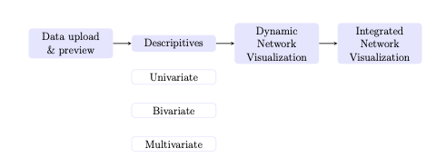
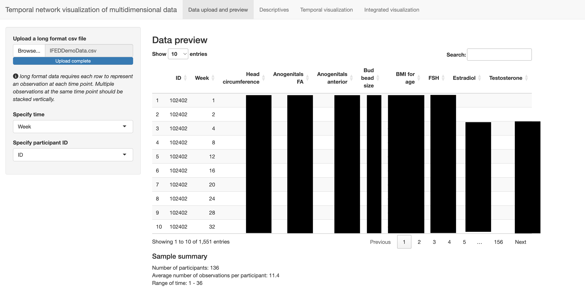
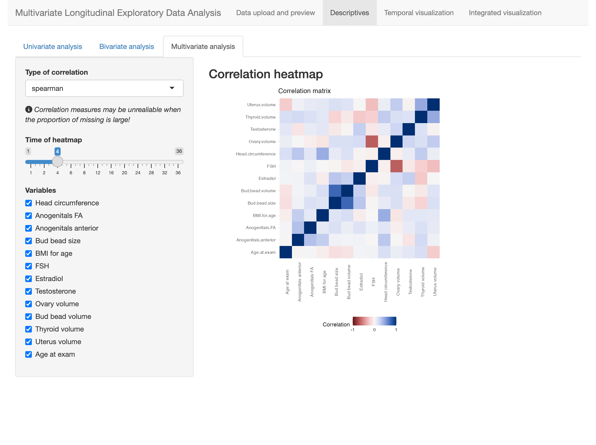

```{r setup, include=FALSE}
knitr::opts_chunk$set(echo = FALSE)

library(tidyverse)
library(here)
```

# Introduction {#sec:intro}

## Motivation 

In many biomedical studies, researchers routinely collect health-related measurements over time. In experimental settings, panels of biomarkers are followed longitudinally to understand the underlying biological processes. In observational studies, procedures are often done repeatedly to monitor progress over time. Our motivational dataset, the Infant Feeding and Early Development (IFED) study, is an example of this type of data structure. In the IFED study, infants are followed up from birth to up to three years old. Physical examples, blood sample collection and ultrasound are scheduled every few weeks to collected measure of growth. Such data structure, characterized by repeated measures of multiple variables, are commonly referred to as multivariate longitudinal data .

Comprehensive exploratory data analysis (EDA) of such data is essential to provide insights into the temporal dynamics of biological processes and their interactions. As the first step in the data analysis pipeline, EDA supports problem identification, hypothesis generation, and design of downstream analysis. In particular, the correlation structure between variables, especially its temporal evolution, can reveal vital information. Therefore, a comprehensive and effective exploration of the time-varying relationship between multivariate longitudinal variables is fundamental. Nevertheless, existing EDA methods and tools for multivariate longitudinal data remain limited, due to its complex and dynamic nature. In particular, exploration of such data largely depends on graphic visualization, which demands substantial technical expertise (e.g. programming with statistical software). As a result, biomedical and clinical experts may be discouraged from conducting thorough exploratory data analyses, which can greatly hinder interdisciplinary collaboration and communication. Furthermore, existing exploratory analysis often consists of isolated summary tables and graphs that are rarely connected. There also lacks a standardize EDA workflow, leaving the choice of methods largely up to discretion. As a result, EDA may be inconsistent or incomplete, making it difficult to form an objective understanding of the data.

These challenges above have inspired the development of mlEDA, an accessible toolkit that provides an interactive and standardized workflow for exploratory analysis of multivariate longitudinal data. This toolkit facilitates comprehensive summarization and visualization of the data structure, with a particular emphasis on time-varying correlations, and is designed for easy use by researchers without extensive statistical or programming background.


## Previous work

Multivariate longitudinal data are characterized by both multi-dimensionality and temporal evolution, which pose challenges for EDA. Traditional EDA methods are largely for univariate or pairwise examinations. Summary statistics (e.g., mean, standard deviation) and plots (e.g. boxplots, histograms) can summarize the distribution of individual variables at each time point, while associations between variables are often presented pairwisely in matrix form, such as correlation matrix, scatterplot matrix or heatmaps. Although effective for low- to moderate-dimensional datasets, these approaches become infeasible as dimensionality increases, due to the rapid growth of information to be processed. In addition, these summaries are static and do not directly reflect temporal changes. To accommodate the time-varying feature, they have to be reproduced at every time point, requiring constant examination and comparison across time slices. Such operation is inefficient and result in high chance of errors and negligence.

Some methods have been proposed for the visualization of high-dimensional or large-scale data, through dimension reduction techniques. One such example is Multidimensional Scaling (MDS) (also known as Principal Coordinates Analysis [@gower1966pcoa]). It is specifically designed to preserve the high-dimensional structure representing pairwise relationships (i.e. similarity). As a result, MDS has been used to visualize correlation. In the R package *corrr* [@corrr], the MDS process is embedded into the *network_plot* function. It represents the correlation matrix on a 2D surface in a network plot format, where each variable is represented by a node and their coordinates is the output of MDS algorithms. This function offers a clean, comprehensive visualization where variable correlation can be intuitively perceived. However, it is a static plot and thus is subject to the same repetition procedure mentioned above when visualizing temporal evolution. *igraph* [@igraph] offers a similar function with the same temporal restriction. Other R packages have been developed to either implement MDS reduction ([@Rbuildin; @MASS; @smacof]) or produce network-based visualizations ([@ggplot2; @ndtv; @networkDynamic]), but rarely combining the two procedure.

All the packages mentioned up require careful data management and substantial R programming expertise, such that domain experts without easy access to these techniques are often discouraged from using them, even though they could significantly improve analysis efficiency. Another shortcoming of existing EDA tools is their in coherence and interactivity. Graphical summaries reflecting different aspects of data are often implemented in isolation. Cross-referencing is frequently needed but not sufficiently supported by the existing exploratory analysis scheme. Existing literature has demonstrated the preference toward interactive tools [@Lakkaraju2022]. Unfortunately, development in this areas has been sparse and lacks standardize EDA workflows. 

# The mlEDA App {#sec:app}

## Motivational dataset {#sec:data}

Our study is motivated by the Infant Feeding and Early Development (IFED) study, an NIH-funded longitudinal observational study of postnatal development of healthy full-term infants born at eight regional hospitals in Philadelphia, Pennsylvania between 2010 and 2013. Details of the study design are described in Adgent et al. (2018). Briefly, eligible infants completed a baseline visit within 72 hours after birth, followed by subsequent visits every 2-4 weeks. Boys were followed for up to? 28 weeks and girls for 36 weeks after birth. At each visit, anthropometric measurements were collected, including length, weight and head circumference. Beginning at week 2, blood sample were collected and analyzed for sex hormones levels, including estradiol, FSH and testosterone . Ultrasound exams were also performed to measure the dimensions of reproductive organs, including breast bud bead, thyroid, uterus and ovary (Figure \ref{fig:ifed}).

This data set has been explored for a variety of questions regarding early development of the reproductive system and sex hormones concentration in this critical developmental window. However, the biological pathways behind these phenomenon remain unclear, largely due to the complexity of multidimensional, dynamic relationships between variables. Existing research often relies on univariate or pairwise examination ([@goldberg2024; @Chin2023]), which provides partial insights instead of comprehensive view. The study design of IFED data also poses challenges. For example, The schedule for blood sample collection and ultrasound are different (Figure \ref{fig:ifed}), and some hormone concentrations are often too low to be detected, resulting in difficulties in correlation calculation.

To address the above mentioned challenges , we have created mlEDA, an interactive web-based application designed for a standardized EDA workflow of multivariate longitudinal data. This application integrates classical EDA components with a novel visualization scheme based on MDS, which displays dynamic evolution of correlations. It guides users through a comprehensive analytical workflow with interactive operations with minimal requirements of technical background and coding experience to facilitate interdisciplinary collaboration. In this the following section, we demonstrate the functionalities of mlEDA in detail using data of the 136 girls from the IFED study. 

```{r ifed, fig.cap="IFED study timeline. Scheduled procedure are indicated by black dots. ", out.width="70%", fig.align='center'}
knitr::include_graphics("../Manuscripts/CaseStudy/IFED_grid.jpeg")
```


<!-- <!-- % potential names: Tnet, TemporalNet, TempoNet --> -->
<!-- To address the challenges in Section \ref{sec:intro}, we have created mlEDA, a web-based application designed for interactive, standardized exploratory data analysis workflow of multivariate longitudinal dataset. This application is an integration of classical EDA components and novel multidimensional visualization scheme with the ability to visualize temporal evolution dynamically and intuitively to human vision. It guides users through an comprehensive analytical workflow with interactive operations. Its usage requires minimal technical background or coding experience, thus desirable for the interdisciplinary collaboration settings. This section will demonstrate the functionalities of mlEDA in details, using the the Infant Feeding and Early Development (IFED) study introduced in \ref{sec:data} as a motivational example. The same data will also serve as a case study example in Section \ref{sec:case_study}.  -->


## Functionalities {#sec:func}

The mlEDA Shiny App guides user through a series of operations to explore various aspects of the dataset (Figure \ref{fig:workflow}) in separate tabs, including data upload and preview, descriptive statistics and graphs, a dynamic network visualization and a time-independent integrated network visualization. All tabs in mlEDA consists of a input panel on the left side for user-specified options, and an output panel on the right side to interactively generate results. Some user input in earlier tabs will be carried to later tabs.

```{r workflow, fig.cap="mlEDA workflow summary", out.width="70%", fig.align='center'}

```

### Data upload and preview
    
The first tab of mlEDA allows user to upload a dataset from their local device. Currently, the dataset is required to be a csv file with long-format, with each row representing observations from one subject at a single time point, and repeated measures at different times should be vertically stacked. The uploaded data will then be displayed on the output panel in a table format, followed by a brief summary of sample size and follow-up times.

Users need to specify the time and subject identifier in this tab, to identify repeated measures over time for future analysis. For the IFED dataset, we used week of the scheduled visit as time. The search box at the top right conner allows users to search for specific record from the dataset, such as certain ID, time, or measurement value. Users can also sort the display by any column by clicking on the column name. 


```{r fig-tab1, fig.cap="Tab 1 of mlEDA: data upload and preview. Individual observations are redacted.", out.width="80%"}

```

### Descriptives

The second tab of mlEDA provides descriptive graphs and statistics from three aspects, under separate subtabs: univariate analysis, bivariate analysis and multivariate analysis.

#### Univaraiate

On the first subtab of “Univariate Analysis”, users can choose a variable from the dataset and examine its distribution across time. User also need to decide whether to treat the time variable defined in the first tab as discrete or continuous. When time grid is relatively sparse (e.g. a limited number of scheduled visits), time can be naturally treated as discrete, and mlEDA summarizes data at each time point. When measurements are recorded on a dense grid, it is more appropriate to treat time as a continuous variable to focus on individual trajectories over time. The choice between discrete and continuous time depends on both the data structure and the analysis context. When time is specified as discrete, the selected variable will be summarized by a sequence of boxplots, with sample distribution at each time point and temporal trend represented by the change in sample median over time. When time is continuous, the app generates a spaghetti plot of individual trajectories, along with a smoothed average trajectory. The app also provides an option to investigate the missing value pattern across both sample and time. User may wish to remove variables or time points with large number of missingness from downstream analysis to improve reliability.

For example, in the IFED study, time can be treated as discrete when defined by visits (12 scheduled visits), or as continuous when defined by age in weeks after birth (36 unique weeks). Figure \ref{fig:fig-tab2-sub1} shows both scenarios for the variable anogenital anterior measure. Both the sample median in (a) and average trajectory in (b) showed a steady increasing trend over time. With discrete time, the boxplots in (a) revealed sample distribution at each visit. With continuous time, figure (b) reveals the variability in individual development over time. The figure of missing patter did not change with the choice of continuous or discrete time because it visualizes missing pattern in the perspective of individual. Each individual is represented by a horizontal line where missing time points are highlighted black. The bottom table, on the hand, summarizes missing by time point, calculating the proportion of missing at each measurement time during follow-up. From Figure \ref{fig:fig-tab2-sub1}, we can see that anogeniatal anterior is generally consistently measured with few missing. However, more than half of the sample (53%) was absent at week 6, which is concerningly high. 


```{r fig-tab2-sub1, fig.cap="Descriptives of individual variable distribution and change over time. Figure (a) uses week of scheduled procedure as time. Figure (b) uses infant age as time, coded as days after birth.", fig.subcap=c("Discrete time", "Continuous time"), out.width = "0.45\\linewidth"}
knitr::include_graphics(c("../Manuscripts/Appshots/tab2.1.1.png", "../Manuscripts/Appshots/tab2.1.2.png"))
```


#### Bivariate analysis

The second subtab examines the bivariate distribution for a pair of variables. Users can choose two variables and their preferred correlation measure (Pearson or Spearman). A plot of correlation trend is then generated in the output panel showing the empirical correlation value at each time point, with size and color hue of each circle indicating the precentage of complete pairs used for calculating the correlation. This information is important in practice, because missing data is a frequent issue in real-world data analysis and causes unreliable correlation measure. An extreme case is week 28 when only two participants had recorded ovary and Bud bead volume. Their correlation then will be 1 or -1, which clearly is not informative. This can happen due to study design. For example, in the IFED study, participants who did not show up for their scheduled visit may have make-up visit at later times. It can also be caused by hardward issue or limit of detection when participants are present. It can also caused by the choice of time variable. If age is considered as time in IFED data, then the 136 participants would be spread over 278 days, making sample size at each time point very small. The empirical correlation therefore frequently hits extreme values, as illustrated in Figure \ref{fig:fig-tab2-sub2}b. 


```{r fig-tab2-sub2, fig.cap="Descriptives of pairwise correlation and its change over time. Figure (a) uses week of scheduled procedure as discrete time. Figure (b) uses infant age as continuous time, coded as days after birth.", fig.subcap=c("Week as discrete time", "Age as continuous time"), out.width = "0.45\\linewidth"}
knitr::include_graphics(c("../Manuscripts/Appshots/tab2.2.1.png", "../Manuscripts/Appshots/tab2.2.2.png"))
```

The correlation grpah allows users to adjust the vertical axis range correlation plot to data. A fixed axis range between -1, 1 give users a better idea of the magnitude of correlation, while a scaled one highlights relative change. In addition, distribution and/or trajectories of the two variables are displayed together below the correlation graph for comparison and reference. The visualization scheme is similar to the previous tab, except now two variables are displayed in one graph for comparison purpose. 

#### Multivariate 

Tab 3 display the empirical correlation matrix in a heatmap, using different colors for direction and hue for magnitude (Figure \ref{fig:fig-tab2-sub3}). User can scroll over the time axis on the input panel to examine its change over time. If a correlation cannot be computed, the corresponding square will be marked gray. 

```{r fig-tab2-sub3, fig.cap="Descriptives of the correlation structure of the entire dataset", out.width="80%"}

```

### Temporal visualization
    
This tab hosts the core functionality of the mlEDA app - a dynamic network graph of multivariate correlation and/or association. We proposed this novel visualization scheme to offer a comprehensive, concise and interpretable representation of the complicated and evolving relationship between multiple measures. The layout reflects the relationship between multiple variables on one 2D surface, with nodes indicates variables, and their relative position indicating the strength of relationship. Strongly associated variables are positioned closer to each other while weakly associated variables are positioned further away.  For example, in Figure \ref{fig:fig-tab3}, the two anogenital measures are very close to each other, indicating very strong correlation between them, which is consistent with intuition considering they measure the same subject from different aspects. 

By scrolling over the time axis on the input panel, user will see the graph layout adjust in a visually stable way, using minimal movement to adapt to the change of data structure over time. The following Section \ref{sec:mds} will explain in detail the how the layout is generated and visual stability is preserved. Here we focus on the visualization scheme. As is shown, the plot essentially maps the strength of correlation onto the distance between nodes on a 2D surface, thus lead to an intuitive visualization that can be efficiently interpreted. 

<!-- As Figure \ref{fig:fig-tab3} shows, the plot is generated by different two different methods, based on user with to perceive time.  -->

```{r fig-tab3, fig.cap="Dynamic network plot of variable association.", fig.align='center', out.width = "0.6\\linewidth"}
knitr::include_graphics(c("../Manuscripts/Appshots/tab3.png"))
```

More interactive features are incorporated in this tab to accommodate users' needs and preferences. Users can choose their preferred method to quantify variable relationship, such has correlation or distance. Users can also choose to highlight strong relationships by specifying a threshold on the input panel. Depending on the choice of measure, strong associations are visualized as an edge connecting the corresponding two variables, and the thickness and color hue of the edges reflects the magnitude of the relationship measure. In Figure \ref{fig:fig-tab3}, spearman correlation is visualized with its threshold is set to 0.5. It follows that edges appeared between FSH and ovary volume, and bud bead size and bud bead volume, meaning these two correlation coefficients are greater than 0.5. In practice, user may also wish to identity groups of variables with stronger association (i.e., "clusters" of variables). mlEDA has a corresponding complementary function on this tab to group variables by performing a time-dependent hierarchical clustering on the association measures. The clustering is implemented on the lower-dimensional coordinates instead of the empirical higher dimensional association matrix, since the lower dimensional structure is more stable over time (see section \ref{sec:mds} for details). Users can choose the number of groups, and the variable vertices will be colored differently by group assignment. A few summary of group labels over time can be displayed below the network graph, where user can examine the change of grouping results over time from different perspectives. If a group of interest in identified, user can also regenerated the plot only for these subset of variables for more detailed analysis. 

### Integrated visualization

The fourth tab offers an time-independent summary of variable association integrating the entire follow up period. It averages the association matrix from all time points during the follow up time, and then visualize this "average" matrix using the same network mechanism as tab 3. User can either treat all time points equally, or weigh them by the time interval in between. The "weighted" option takes a "last observation carried over" approach, assuming correlation structure does not change until the next time point. It therefore weighs each time point by the length of following interval. This time-independent summary could be good complementary information to user inspection. As Figure \ref{fig:fig-tab4} shows, the structure of this tab is very similar to tab 3, except for the time-dependent components. They also share similar interactive functionalists, such as specifying association threshold, grouping, and choosing subsets of data. 

```{r fig-tab4, fig.cap="Integrated netowrk visualization of correlation or association matrix", fig.align='center', out.width = "0.6\\linewidth"}
knitr::include_graphics(c("../Manuscripts/Appshots/tab4.png"))
```

# Dynamic netowrk plot of variable association {#sec:mds}

In this section, we explain in more details about the core functionality of mlEDA: the dynamic netowrk plot of variable association. We explain the method used for plot layout generation, how the high-dimensional assocaition structure is preserved and how visual stability across time is enhanced.

## Multidimensional Scaling

As in Section \ref{sec:intro}, exploratory data analysis (EDA) methods for multivariate longitudinal datasets are not yet well-developed. In the aspect of data reduction, existing literature largely focuses on studying the relationship between subjects but not variables. Principal component analysis (PCA) or clustering, which are arguably the two most widely used EDA methods for complicated data, both set up the data with rows as subjects and columns as variables [@esl2ed]. However, exploration of feature association is the study of relationship between \textit{variables}, or in other words, the matrix of bivariate quantitative association measure, such as correlation, association, or distance. This distinction makes many existing methods inapplicable, because association matrices do not satisfy may common assumptions these methods make, such as i.i.d observations. However, multidimensional scaling (MDS) is appropriate in this case, because it is highly flexible with few assumptions on the high-dimensional data structures. It assumes that the high-dimensional matrix is square and symmetric matrix with zero diagonal elements. The values in the matrix should corresponds to a "dissimilarity" between variables. Most association measures satisfy, or can be easily converted to meet these assumptions. 

Essentially, MDS generates variable layout by estimating a set of low-dimensional coordinates that resembles the high-dimensional association matrix as much as possible. Specifically, for a dataset $\mathbf{X}$ with P variables $X_1$, ..., $X_P$, at a specific time point, the relationship between variables will be represented by a P-dimensional matrix: $\Sigma(\mathbf{X}) = \{\rho_{lp}\}$, where $\rho_{lp}$ is the relationship between $\mathbf{X_l}$ and $\mathbf{X_p}$. MDS will first transform this higher-dimensional matrix into a "dissimilarity" matrix: $\symbf{\Delta} = \{\delta_{lp}\}$, with the method of transformation dependent on the chosen measure. In mlEDA, correlation is transformed as $\delta_{lp} = 1-|\rho_{lp}|$. Euclidean distance on the other hand can be a dissimilarity measure itself and needs no more transformation. 

The next step is to reduce the higher-dimensional dissimilarity  $\symbf{\Delta}$ onto a 2D surface. In the Cartesian coordinate system, a variable $X_p$ is represented by two coordinates $(c_{p1}, c_{p2})$ indicating horizontal and vertical positions respectively. The distance between any pair of variables, given their coordinates, can be easily calculated: $d_{lp} = \sqrt{(c_{l1}-c_{p1})^2+(c_{l2}-c_{p2})^2}$. The matrix of pairwise Euclidean distance is a P by P matrix: $\mathbf{D}= \{d_{lp}\}$. Since we would like the geometrical distance to reflect higher-dimensional measures, this problems comes down to minimizing the difference between $\symbf{\Delta}$ and $\mathbf{D}$. This leads to the stress loss function [@kruskal1964]: 

\begin{equation}
    Stress(\mathbf{C}) = \frac{||\symbf{\Delta} - \mathbf{D}||^2}{||\symbf{\Delta}||^2}.
    \label{eq:stress}
\end{equation}

By minimizing the stress loss \ref{eq:stress}, we will be able to get the 2D coordinates that is most reflective of the correlation structure. 

## Temporal stability

Note that the MDS algorithm alone does not consider time changes. The classic algorithm proposed by [@gower1966pcoa], as well as many its extensions, are able to visualize one matrix at a single time. For a series of matrices at different time point, there needs to be one separate MDS procedure at each time point. We can consider the evolution process of data structure as a "movie", then each representation generated by MDS at a specific time point would be a "frame". However, simple repeated implementation cause visual instability problems. Regeneration will induce random initialization of vertices positions. Although the higher-dimensional structure can be presered at each time point, variable nodes will rotate around the surface with no connection to the previous time points, causing high visual instability and disorientation. This goes against the purpose of mlEDA, which is to introduce intuitive visualization that is easy for human comprehension. A temporally stable extension of classic MDS is needed to solve this issue. In this section, we will introduce two different approaches for this purpose: Dynamic MDS and Splines MDS. The major difference between these two methods is how they perceive the time variable. While Dynamic MDS treats time as discrete points, Splines MDS treats time as the observations of a continuous variable. 

### Dynamic MDS

One way to achieve visual stability over time is to minimize the change of layout between adjacent time points. This leads us to the Dynamic MDS methods by [@xu2012], which impose penalization on the coordinate change between all adjacent slices. The loss function in this case is penalized stress below: 

\begin{equation}
 Loss(\mathbf{C}) = \sum_{t}\frac{||\symbf{\Delta}_t - \mathbf{D}_t||^2}{||\symbf{\Delta}_t||^2}+
 \lambda ||\mathbf{C}_t-\mathbf{C}_{t-1}||^2.
    \label{eq:dMDSloss}
\end{equation}

This method is very straightforward and works well on datasets that are regularly measured with low measurement density. However, the computation time increases exponentially with measurement grid density and quickly becomes unfeasible. In addition, this method also works poorly with the presence of irregular measurement grid, when variables in the data are measured at different time points. Unfortunately, both issues are very common in practice. As in Section \ref{sec:data}, in the IFED study, the three procedures are not scheduled in conjunction. Office visits and sample collection are scheduled twice as frequent as ultrasounds. From Equation \ref{eq:dMDSloss} we can see that only vertices that are present in both adjacent time points can be counted into the penalization. At time points when growth measures and hormones are present but ultrasounds are complete missing, the relationship between ultrasounds and other measures cannot be calculated, and these variables cannot be visualized. The corresponding vertices, as a consequence, will appear and disappear from the graph repeatedly, causing more visual disorientation.

<!-- use simulation to demonstrate time?  -->

### Splines MDS

While the relationship between variables changes with time, we can also assume this evolution to be a smooth process. It follows that its lower-dimensional representation will also be a smooth process, represented by smooth coordinates \text{functions} over time: $\mathbf{C}_t = (c_{p1}(t), c_{p2}(t))$, where $p = 1....P$. A natural choise is to model the coordinates using spline basis functions:

\begin{equation}
\begin{aligned}
c_{p1}(t) &= \sum_{k=1}^K \xi_{pk}\phi_k(t) = \symbf{\xi}_p \mathbf{\Phi}(t) \\
c_{p2}(t) &= \sum_{k=1}^K \zeta_{pk} \phi_k(t) = \symbf{\zeta}_p \mathbf{\Phi}(t)
\end{aligned}
\end{equation}

The position of the vertex indicating variable $X_p$ will then change smoothly with t, determined by parameters $\symbf{\xi}_p$ and $\symbf{\zeta}_p$. The lower dimensional representation $\mathbf{D}$ will be a collection of the smooth coordinates: $\symbf{D}(t, \symbf{\xi}, \symbf{\zeta}) = \{\mathbf{c}_p(t), p = 1...P\}$. And the stress function can be written as $Stress(\mathbf{C}(t, \symbf{\xi}, \symbf{\zeta})) = \frac{||\symbf{\Delta}_t - \mathbf{D}(t)||^2}{||\symbf{\Delta}_t||^2}$. As time changes, the stability of layout can be controlled by penalizing the "smoothness" of coordinate functions, such as their second derivatives:

\begin{equation}
\begin{aligned}
    Loss(\symbf{\xi}, \symbf{\zeta}) = \int_t Stress(\symbf{C}(t, \symbf{\xi}, \symbf{\zeta})) + \sum_{p=1}^P\lambda(\symbf{\xi}_p+\symbf{\zeta}_p)\symbf{\Phi}''
    \label{eq:SPLloss}
\end{aligned}
\end{equation}

Splines MDS layout estimated by minimizing Equation \ref{eq:SPLloss} has a few advantages over the Dynamic MDS approach. First of all, the Splines basis functions are shared across variables. Therefore, the vertex coordinates computed here is determined by spline basis coefficients $\symbf{\xi}_p, \symbf{\zeta}_p$, which are time-independent. With irregular measurement grid, although some variables can be completely missing at some time points, their layout could still be computed in a consistent manner. The mlEDA app supports this function and annotates the completely missing variables with unfilled circles instead of solid nodes. This keeps all variables in the plot and thus makes it more visually stable, revealing smooth, gradual structural evolution over time without the burdent of constantly adjusting to disppearing/reappearing nodes.

In addition, with the measurement grid is dense, the loss function \ref{eq:SPLloss} is a lot more efficient to minimize, because it estimates a lot less parameters and also can be paralleled over time. For example, the different of computation time between Dynamic and Splines MDS, when used on IFED data with age as time, is a few hours versus a few minutes, making Splines MDS the only feasible choice for visualization. 

# Case Study {#sec:case_study}

In this section, we demonstrate the practical utility of mlEDA using the discoveries it revealed on the IFED data. Because the essential difference in the reproductive system between sexes, boys and girls are usually analyzed separately. In this paper, we focus on the 136 full-term infant girls from the IFED study, exploring the interaction and evolution of physical growth, organ growth and hormone concentrations. Although existing literature on girls' early reproductive development is extensive, the discoveries showed controversies and complications. We hope this tools can offer novel insight using its concise, interpretable visualization and facilitate the generation of new hypothesis. Please note that though mlEDA provides different options for visualization, this paper will focus on evolution over week as a continuous time measure and spearman correlation as the association measure. 
<!-- reasons for this choice? -->


<!-- individual trend -->
Most physical growth measures, including head circumference and anogenital measures, showed steady growing trend over the entire follow-up period. Head circumference increased quickly during the first 3-4 months, and than gradually reaching a plateau at the end. Anogenital measures had a lot more fluctuation over time. Age-adjusted BMI stayed stable as expected. Hormone concentrations, on the other hand, showed high variability across individual and more fluctuation over time. Considering sample average, FSH, estradiol and testosterone all showed very slow and steady decrease over the 36 weeks. On the other hand, most individual tracks showed similarity, with at least one peak at different timing and with different magnitude. Most estradiol tracks started with a decrease in concentration at the first 5-10 weeks followed by small fluctuations. Some subjects had brief increase at week 12, 20 or 28. Testosterone showed a similar trend, with high initial concentration right after birth, a rapid decrease from 4-12 weeks and then fluctuations. The initial decreasing is likely due to subsiding placental hormones. Organ volume measured from ultrasound also showed notable heterogeneity. The average bud bead volume showed an initial increase from week 1-4, then flatten out across the following weeks. However, the individual tracks showed sharp increases of partial sample at week 4, 12 and 24. Similarly, the average ovary volume slowly increased from week 1-4 and plateaued, while individual tracks showed waves of peaks at week 4, 8, 12 and 24. Uterus volume had a more uniform trend, as most infants showed a sharp decline in volume from week 2 to 4. While most infants stayed steady after, there are infants whose uterus volume showed a later peak, but also across different timings including week 8, 12 and 24. Overall, the individual development track of reproductive organs and hormones revealed the existence of rapid development periods, but the timing and magnitude can be very different across individual. An average trend over sample might not be a good summary measure in this case. A more appropriate target of analysis would be the pattern of change over time. 

<!-- Pairwise correlation -->

The correlation between most growth measures are stable over time. Head circumference and BMI showed stable moderate correlation (0.5), and the two anogential measures (FA and anterior) showed slowly increasing correlation from roughly 0.2 to 0.5 over the first few weeks. The correlation between hormone concentrations are weaker, fluctuating across zero throughout follow-up. The correlation between estradiol showed a brief increase from 0.25 to 0.5 during week 4-8, but the soon decreased back to zero at week 16. In terms of reproduce organ volumes, some showed slight increase of correlation over the first few weeks. The correlation between ovary and uterus increased from 0.1 to 0.25 during the first few weeks. Similar for bud bead and uterus, their correlation increased to 0.3 during the first 8 weeks. Both correlation then decreased slowly until about week 24. Ovary and bud bead volume, on the other hand, did not show the initial correlation increase. Their correlation stayed at around 0.25 until week 16, followed by a slight decrease. The pairwise correlation between growth measures and hormones are generally close to zero with small fluctuations. The correlation between hormone concentrations and reproductive organ volumes are more uncertain, which is partly due to the inconsistency in procedure schedule and missing observations. Their correlation is generally week, with the exception of FSH and ovary value, which showed moderate negative correlation (-0.5-0.6) consistently throughout the study period. FSH and uterus has been weakly correlated (~-0.25) until week 24 when correlation reduced to zero. Estradiol and uterus showed a quick increase from 0 to 0.5 during the first 8 weeks, followed by decrease in the next 8 weeks.  

<!-- # notes: try to avoid observations after week 24 because of a lot of missing -->

<!-- Network graph -->

The dynamic network graph on tab 3 offers a comprehensive view of the evolution of the multidimensional correlation structure over time. This graph reflects the strength and change of relative correlation by the change in node positions. We start from week 4, which is the first time point when all measures are collected. As Figure \ref{fig:ifed-dcan}a shows, measures of growth, hormones and organs are roughly evenly distributed across the surface, indicating correlation across board is roughly equal and weak, which may corresponding to a "balanced" state right after birth before the rapid development began. Two growth measures, head circumference and age-adjusted BMI, are positioned close to each other at the top-left conner, indicating strong correlation at this time point. Similar with Ovary volume and FSH on the top-right corner. Both positions are consistent with their time-specific bivariate correlation (~0.5). The two anogenital measures are placed more apart, corresponding to the initial weak correlation (0.2-0.25) from weeks 1-4. Testosterone are slightly further from FSH and ovary volume, indicating weaker correlation. In fact, moving on from week 4, we can observe testosterone moving further away from FSH and ovary volume (\ref{fig:ifed-dcan} b). The two anogenital measures moved much closer from week 4 to 8, consistent with the increasing bivariate correlation from 0.2 to 0.5 during this period. They also clustered with other growth measures (head circumference and age-adjusted BMI). On the other side of the plot, FSH, estradiol, uterus volume, ovary volume and bud bead volumes also showed clustering effect. The physical growth measures were separating from the hormone concentrations and reproductive organ volumes. Testosterone and thyroid volume lays in between, showing association with neither group.


Approaching week 16, the cluster structure separating growth meausres from hormones and organ volumes stayed stable, but some previously close variables slowly disperse apart. Comparing \ref{fig:ifed-dcan}b and d, it is clear FSH and ovary volume moved further away. The growth measures showed more clustering to the center of the plot and closer to thyroid volume at week 16. Week 12 in the Figure below reflects an "in-between" status between week 8 and 16. Note that ultrasound was not scheduled at this week, therefore there are no organ volume measures in the data at this point. However, Splines MDS was able to impute their positioning given the layouts at other time points. This provides more visual stability compared to traditional dynamic MDS, in which the missing measures will simply disappear.

```{r ifed-dcan, fig.cap="Selected dynamic network graph of spearman correlation the IFED data.", fig.width=5, fig.align='center'}
dcan_name <- c("week4.png", "week8.png","week12.png","week16.png")
captions <- c("(a) Week 4", "(b) Week 8", "(c) Week 12", "(d) Week 16")

dcan_list <- list()
for(p in seq_along(dcan_name)){
  path_p <- paste0("Manuscripts/CaseStudy/", dcan_name[p])
  img_p <- png::readPNG(here(path_p))
  dcan_list[[p]] <- ggplot() +
    annotation_raster(img_p, 0, 1, 0, 1) +
    theme_void()+
    labs(title = captions[p])+
    theme(title = element_text(size = 7))
}

gridExtra::grid.arrange(grobs = dcan_list, ncol = 2, nrow = 2)
```


# Discussion (to be expanded)

In summary, mlEDA provides an standardized workflow for exploratory data analysis of multivariate longitudinal data with complicated, time-dependent structure. It guides users through a series of analytically operations, and at each step intuitive visualization and summaries are generated interactively. Through intentional choice of comprehensive, concise visualization, the analysis results are easier to interpret, even for users without statistical background. Users can easily examine the distribution of each variable and the relationship between a set of variables at each time point, as well as their evolution across time. The interactive user inteface also minimize the need for computer programming, making the web base app friendly to users without technical background. Our case study has revealed it's high efficiency in facilitating interdisciplinary communication in a collaborative setting. Domain experts are actively engaged and highly encouraged to provide feedback by the straightfoward visualization. Its application on IFED data has led to observations consistent with previous literature on infant early development and "minipuberty". Moreover, it also revealed new discoveries that have been previously unidentified or underexplored, including the joint, dynamic correlation between FSH, ovary, uterus and estradio from week 4 to 16, as well as the similarity trajectory shape of hormon concentration with various timing and magnitude. This new discoveries has confirmed the limitation of traditional statistical methods based on population time-specific mean. They pointed out promising directions for future investigation and analytical strategies. In reality, these effective initial explorations can improve efficience and resource allocation. 

The statistics and graphics mlEDA uses for univariate and bivariate summary (tab 2) are classical methods that have been well-established and widely used in exisiting literature. However, as the introduction pointed out, methods for full-picture summary of multivariate dataset are still restricted and difficult to implement, especially when temporal evolution is involved. mlEDA provides an intuitive dynamic network graph that fills in this gap. However, the graphical scheme still has limitations. The visualization of a high-dimensional correlation matrix is essentially a dimension reduction problem, and thus information loss in inevitable. The positions of variable nodes may not exactly reflect the original correlation structure. When visual stability over time is introduced, the layout at a specific time is also affected by other time points. In reality, datasets often have missing value, or inconsistent measurement grid as IFED study, both affecting the quality and stability of visualization. Last but not least, both methods are not efficient enough to handle large-scale datasets, like EHR. Improvement of visualization efficiency is a key point of future investigation. 


## References


