```{r setup, include=FALSE}
knitr::opts_chunk$set(echo = FALSE)  # hide code — end users don't need to see it
library(shiny)
library(ggplot2)
theme_set(theme_minimal())
```

<!--
SETUP NOTES (delete this comment block once done):

1. Replace both placeholders in the "How to access this app" section
   below with your actual web app URL and GitHub repo URL.
-->

## Introduction 

This app helps you explore **multivariate longitudinal data** , which includes multiple measures repeatedly collected on the same sample over time, without coding yourself! You upload a spreadsheet, and the app lets you preview your data, examine variable distribution, compare pairwise correlation, and visualize multidimensional relationships between variables as a **dynamic network**, where variables with strong correlation are placed closer and vice versa. 

There are two ways to use the app:

### Option 1: Use the web app (no installation required)

The app is hosted online — just open the link below in your browser:

**[Web App Link](#) <!-- PLACEHOLDER: replace with your Posit Connect app URL --> **

This is the easiest way to get started, especially if you don't use R.

### Option 2: Install the package and run it locally

If you'd like to run the app on your own computer (e.g., for larger
files, offline use, or to inspect/modify the code), you can install
the package from GitHub and launch the app yourself:

```{r, echo = TRUE, eval = FALSE}
# install.packages("remotes")  # if not already installed
remotes::install_github("your-org/your-repo")  # PLACEHOLDER: replace with your GitHub repo

library(yourPackage)  # PLACEHOLDER: replace with your package name
run_app()             # PLACEHOLDER: replace with your app's launch function, if different
```

**[GitHub Repository](#) <!-- PLACEHOLDER: replace with your GitHub repo URL --> **

Try it with your own file, or use this [sample dataset](https://github.com/YinglJin-0203/DynamicCorNet/blob/main/SampleData/Sim_Example.csv).


## Tab 1: Data upload and preview

Currently, mlEDA supports comma-separated values (CSV) file in long format, with each row representing one subject at a single time point, and repeated measurements are stacked vertically across time. Users need to specify the **subject identifier** and **time variable** in the input panel, as they define the longitudinal structure for downstream analysis. 

```{r, out.width="60%", fig.align="center"}
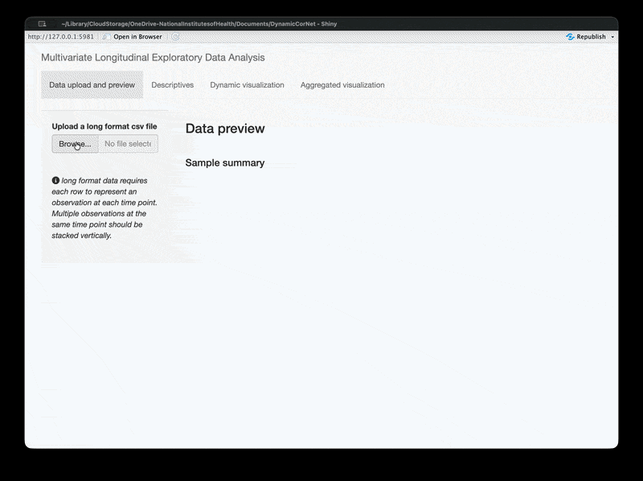
```


Once uploaded, the data is displayed in the output panel as a table, followed by a brief summary of sample size and follow-up times. Users can use the search box at the top right corner to identify a specific record. Users can also sort the display by any variable by clicking the corresponding column name.

 <!-- https://ezgif.com/optimize/ezgif-6e202c33e8383881.gif -->

## Tab 2: Descriptives

The second tab of mlEDA provides descriptive summaries from three aspects organized into separate subtabs: univariate, bivariate and multivariate analyses.

### Tab 2.1 Univariate analysis

The first subtab of univariate analysis allows users to specify one variable to examine its distribution and trajectory across time. 

```{r, out.width="60%", fig.align="center"}
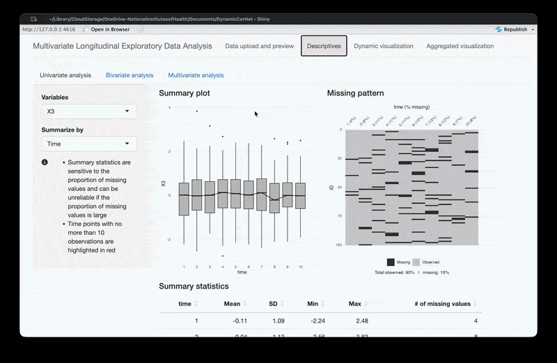
```

Summary statistics and graphs can be generated by measurement time point or by individual. The former focust on the sample distribution at each time point, while the latter focus on the describing the temporal trajectory of each participant.

```{r, out.width="60%", fig.align="center"}
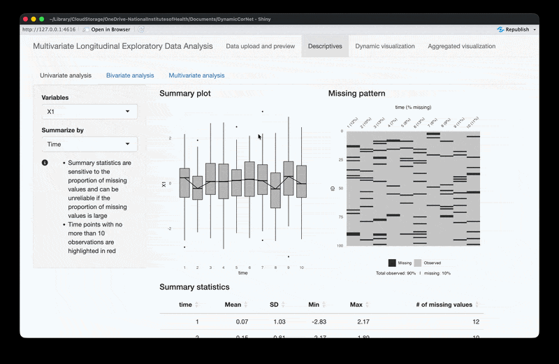
```

This subtab also provides information on missing data by both time and individual. Since missing data can affect the reliability of summary statistics and downstream analysis, time points or individuals with high proportion of missingness will be highlighted.

```{r, out.width="60%", fig.align="center"}
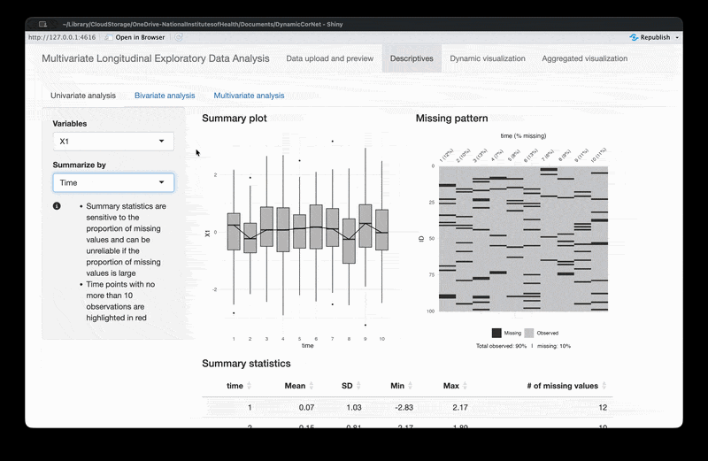
```


### Tab 2.2 Bivariate analysis

The second subtab of bivariate analysis examines the distributions and correlation for a pair of selected variables. Users specify a correlation measure (Pearson or Spearman) and two variables of interest. 

```{r, out.width="60%", fig.align="center"}
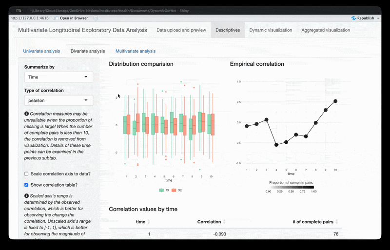
```


The first figure displays the distributions and temporal trends of the two variables. Similar to the univariate analysis, results can be summarized by either time point or individual, with boxplots and spaghetti plots, respectively. 

```{r, out.width="60%", fig.align="center"}
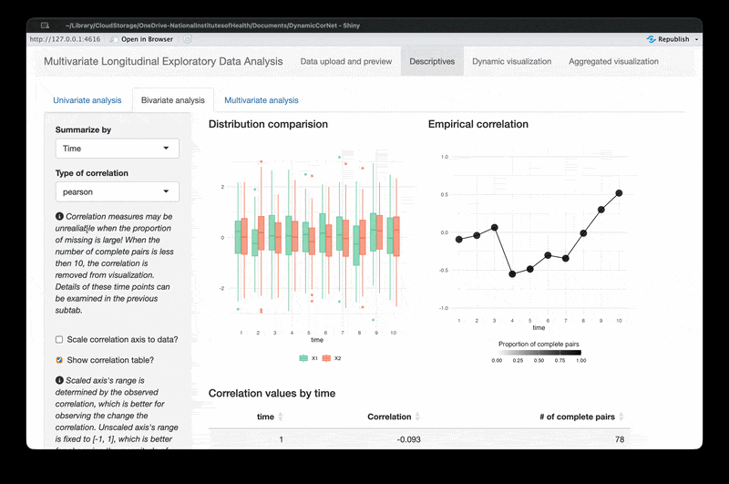
```

The second figure shows the empirical correlation between the two variables over time. The color hue indicates the percentage of participants with complete pairs of observations at this time point. Correlations based on less than five participants are excluded from the figure due to potential instability. Users can also choose to scale the vertical axis range.

```{r, out.width="60%", fig.align="center"}
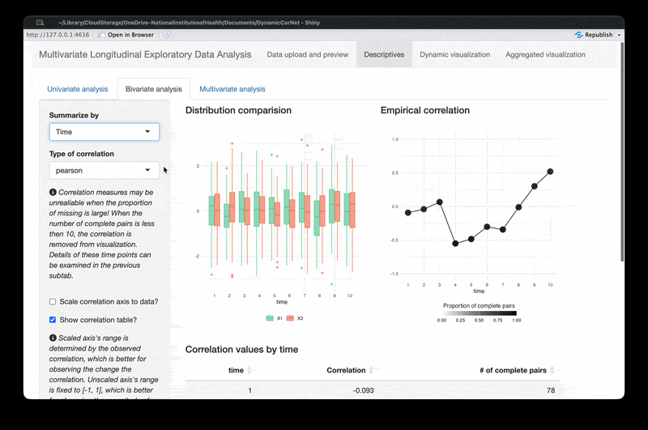
```

### Tab 2.3 Multivariate analysis

The third tab shows correlation matrix in the form of a heatmap,  with colors indicating direction and intensity for magnitude. User can examine how correlation structure changes over time by scrolling the time bar in the input panel. 

```{r, out.width="60%", fig.align="center"}
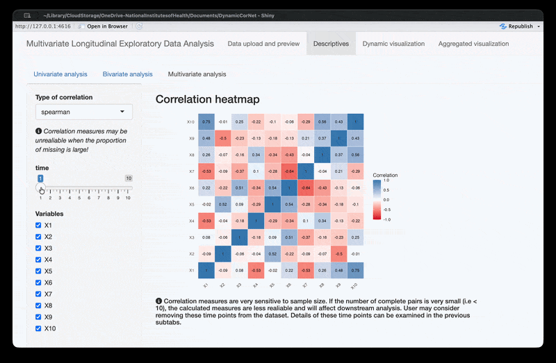
```

They can also choose any subset of variables for closer examination. 


```{r, out.width="60%", fig.align="center"}
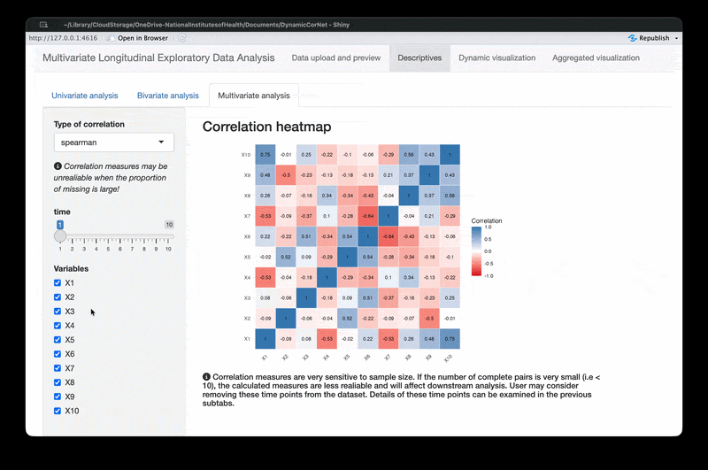
```

## Tab 3: Dynamic visualization

This tab hosts the core functionality of mlEDA: a dynamic network plot of the relationship among multiple longitudinal variables. The relationship between variables, often measured by correlation, distance or other similarity/dissimilarity measures, are represented on a 2D surface. Each variable is represented by a node,  and strength of association between variables are reflected by the distances between nodes. Variables with strong association are positioned closer in the network. Across time, changes of association structure are reflected in graphic evolution. The movement of nodes is stabilized to avoide abrupt transition caused by noise, thus maintain consistent interpretation.

The image below shows an example of a Dynamic Network Plot generated by mLEDA of a simulated data. In this GIF, we can see that the nodes representing variables 2 (X2) and 9 (X9) slowly moved closer over time. This indicates their Spearman correlation has been increasing. On the other hand, Variables 5 (X5) and 6 (X6) moved further apart, indicating decreasing Spearman correlation. 

```{r, out.width="60%", fig.align="center"}
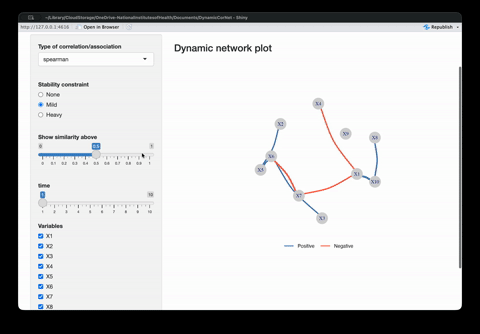
```

Currently, mlEDA supports three measures of variable relationship: Pearson correlation, Spearman correlation, and Euclidean distance. Pearson correlation measures the **strength and direction** of **linear** relationship between variables, while Spearman correlation is a nonparametric measure for **monotonic** relationship. Euclidean distance measures the **geometric distance** between two variables as vectors. Because of the different interpretations of these measures,  users should select one that best fits their analysis purposes. 


```{r, out.width="60%", fig.align="center"}
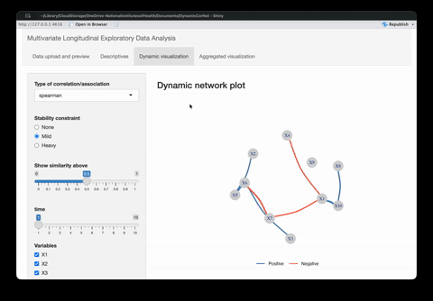
```


As mentioned above, the graph evolution is stabilized for robust interpretation. However, high stabilization is achieved at the expense of lower accuracy. mlEDA allows users to specific their preference for the accuracy-stability trade off by offering *stability constraint* options: no constraint, mild constraint or heavy constraint. 

Below is an example of no stability constraint. This is technically the most accurate visualization. However, it is very difficult the keep track of the dramatic movement of nodes.

```{r, out.width="60%", fig.align="center"}
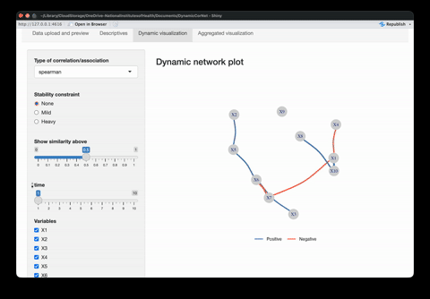
```

Below is another example of heavy stability constraint. The nodes barely move across time, which is apparently not an accurate reflection of the Spearman correlation structure.

```{r, out.width="60%", fig.align="center"}
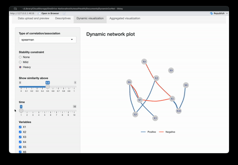
```

Users also have the option to highlight strong association over a predefined threshold. In the examples above, Spearman correlations greater than 0.5 are highlighted with a edge connecting variable vertices. However, if the observations are noisy, we recommend raising the threshold, as strong meansurement is likely an artifact of noise. Such edges are not informative but still disturb the visualization. Therefore, it would be better to examine based on vertex layout.

```{r, out.width="60%", fig.align="center"}
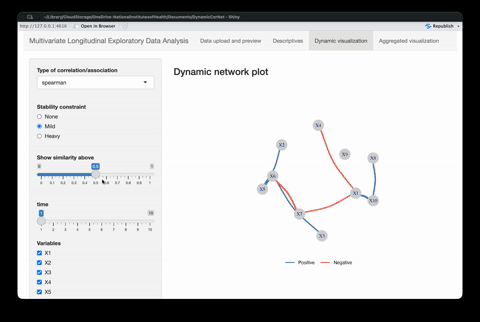
```

Finally, user can also re-generate the graph for any subset of variables.


```{r, out.width="60%", fig.align="center"}
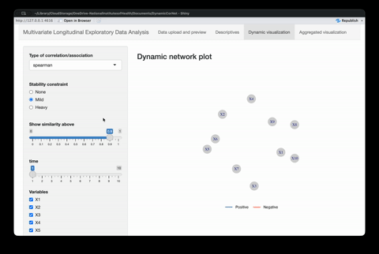
```


